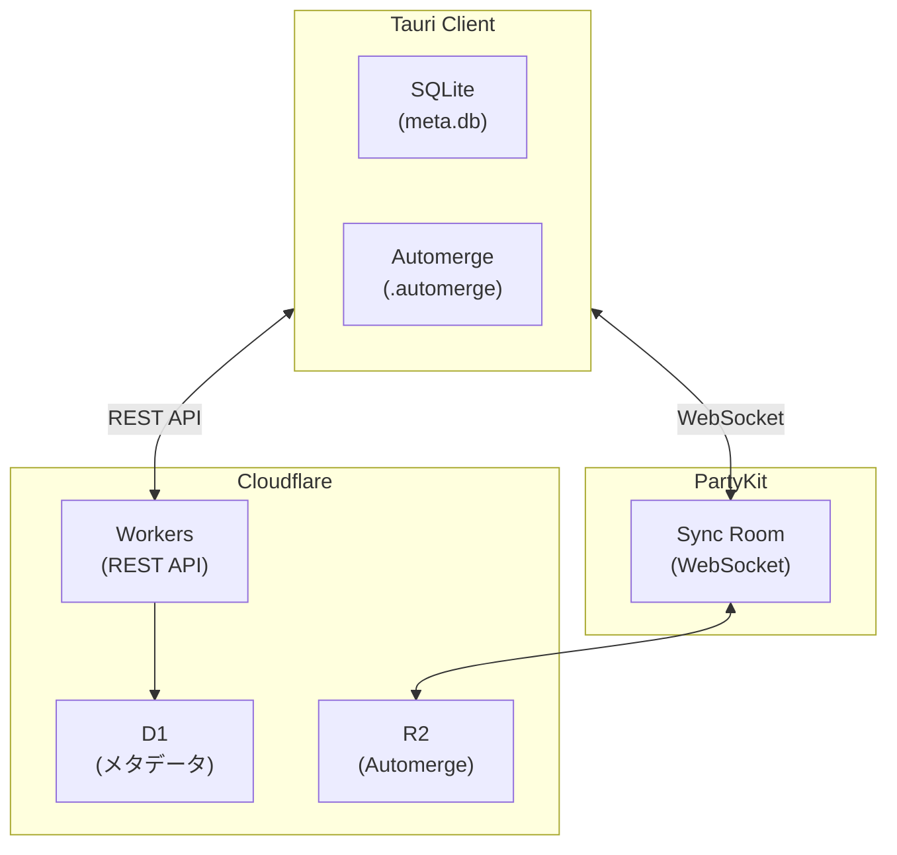

# 高速ドラフティングツール Jot Deck 基本設計書

## 1. プロジェクト概要

### 1.1 プロジェクト識別子

| 項目 | 値 |
|:---|:---|
| **プロダクト名** | Jot Deck |
| **ドメイン** | jot-deck.com |
| **パッケージ名** | `jot-deck` |
| **Tauri bundle identifier** | `com.jot-deck.app` |
| **GitHub リポジトリ** | `plageoj/jot-deck` |
| **リポジトリ構成** | monorepo (pnpm workspaces) |

### 1.2 monorepo 構成

```
jot-deck/
├── apps/
│   └── desktop/              # Tauri + Svelte アプリ
│       ├── src/              # Svelte フロントエンド
│       ├── src-tauri/        # Rust バックエンド
│       └── package.json
├── packages/
│   ├── ui/                   # 共通 UI コンポーネント
│   ├── partykit/             # PartyKit 同期サーバー (jot-deck.partykit.dev)
│   └── workers/              # Cloudflare Workers API (api.jot-deck.com)
│       ├── src/
│       │   ├── index.ts      # エントリポイント
│       │   ├── routes/       # API ルート
│       │   │   ├── auth.ts   # Google OAuth
│       │   │   ├── stripe.ts # Stripe Webhook
│       │   │   └── ai.ts     # AI API プロキシ
│       │   └── db/           # D1 スキーマ・クエリ
│       ├── wrangler.toml
│       └── package.json
├── docs/                     # 設計ドキュメント
├── pnpm-workspace.yaml
├── package.json
└── turbo.json                # Turborepo (ビルド最適化)
```

### 1.3 コンセプト
**「思考の速度で書き、AIで結晶化させる」**
NotionやWorkflowyなどの既存ツールを「重い」「遅い」と感じるパワーユーザーに向けた、キーボード操作特化型のローカルファースト・メモアプリ。TweetDeckのようなカラム型UIを採用し、断片的なアイデア（ドラフト）を高速に入力・結合・整理する。

### 1.4 コアバリュー (USP)
* **圧倒的な速度:** 起動0.5秒、入力遅延ゼロ。数万件のカードがあってもカクつかない。
* **思考の断片化:** 長文を書かせず、140字程度の「カード」を積み重ねる体験。
* **キーボード完結:** マウスに手を伸ばす時間を排除。
* **AIによる収束:** 散らばった断片をAIが文脈を理解して統合・清書する（マネタイズポイント）。

### 1.5 用語定義
| 用語 | 説明 |
| :--- | :--- |
| **Deck** | Columnの集合。Excelのワークブックに相当。ユーザーは複数のDeckを持てる。 |
| **Column** | Cardを縦に並べる領域。Deck内に複数作成可能。 |
| **Card** | テキスト入力の最小単位。140字程度を想定するが、文字数制限はなし。 |
| **Tag** | カード本文中の `#word` 形式で記述。Deck全体での絞り込みに使用。 |

---

## 2. 技術スタック選定

「パフォーマンス」と「クロスプラットフォーム開発効率」を最優先する。

### 2.1 クライアント

| レイヤー | 採用技術 | 選定理由 |
| :--- | :--- | :--- |
| **App Shell** | **Tauri v2** | 軽量(数MB)、爆速起動、OSネイティブWebview利用。 |
| **Backend** | **Rust** | メモリ安全性、高速処理、AI/DB制御の堅牢性。 |
| **Frontend** | **Svelte + TypeScript** | 仮想DOMを持たないため、大量のDOM描画でも高速。 |
| **Database** | **SQLite + rusqlite** | ローカル単一ファイル、FTS5(全文検索)。非同期化が必要になった場合は sqlx へ移行検討。 |
| **ID生成** | **ULID** | 時間順ソート可能、文字列比較でソート可能、UUID v7 より安定。 |
| **Editor** | **CodeMirror 6** | 軽量かつ高機能。Vimモード対応が容易。 |
| **Virtualization** | **TanStack Virtual** | 画面外の要素を描画しない仮想スクロール（必須要件）。 |

### 2.2 クラウド（将来実装）

| レイヤー | 採用技術 | 選定理由 |
| :--- | :--- | :--- |
| **API** | **Cloudflare Workers** | エッジ実行による低レイテンシ。 |
| **Database** | **Cloudflare D1** | SQLite互換、ローカルDBとスキーマ共有可能。 |
| **Storage** | **Cloudflare R2** | Automergeドキュメントのバイナリ保存。 |
| **Realtime** | **PartyKit** | WebSocket + Automerge同期。Cloudflare上で動作。 |
| **CRDT** | **Automerge** | 競合のない同期。Rust/WASM対応。 |

### 2.3 外部サービス

| レイヤー | 採用技術 | 選定理由 |
| :--- | :--- | :--- |
| **AI** | **Gemini (Streaming)** | MVP での AI 清書機能。ストリーミングでUX向上。将来的に Claude/OpenAI への拡張を想定。 |
| **認証** | **Google OAuth** | MVP ではGoogle認証のみ。 |
| **決済** | **Stripe** | サブスクリプション課金。 |

---

## 3. UI/UX デザイン

### 3.1 画面レイアウト (The Deck)
* **マルチカラム構成:** 画面を縦に分割したカラムが横に並ぶ（TweetDeck/Trelloライク）。
* **カード:** 各カラム内にテキスト入力エリア（カード）がスタックされる。
* **ソート順:** デフォルトは `created_at DESC`（新しい順）。Deck ごとに設定可能。

### 3.2 入力体験の最適化
* **View / Edit モードの分離:**
    * 通常時: 軽量な `div` または Markdownレンダラー（描画コスト低）。
    * フォーカス時: `CodeMirror` インスタンスに切り替え（編集機能有効化）。
* **CodeMirror インスタンスプール:** フォーカスごとに生成せず、LRUキャッシュで使い回す。
* **Markdown表示:** 設定で Markdown レンダリング / プレーンテキスト表示を切り替え可能。編集時は常にプレーンテキスト。

### 3.3 タグ機能
* カード本文中の `#word` を自動的にタグとして認識。
* `#` 入力時に既存タグを補完候補として表示。
* タグ選択で Deck 全体を絞り込み表示。
* 絞り込み中は検索バー風の UI でフィルター状態を表示。

### 3.4 Column 管理
* ユーザーが自由に作成・削除・命名可能。
* Column 数に制限なし。
* 新規作成時の名前は `a-col`, `b-col`, ... `z-col`, `aa-col` 形式で自動生成。
* 名前は `<input>` 全選択状態でユーザーに渡され、そのまま確定または上書き可能。
* 名前は後から編集可能（表示名であり、内部参照には使用しない）。
* **論理削除:** Column 削除は即時実行（確認ダイアログなし）。所属する Card も連動して論理削除。
* **Undo:** 削除直後は `u` で復元可能。
* **ゴミ箱:** `g t` で削除済み一覧を表示し、復元可能。
* **物理削除:** 30日後に自動で物理削除。
* **遅延ロード:** 可視領域外の Column はプレースホルダー表示、Intersection Observer で可視時にロード。

### 3.5 Deck 管理
* ユーザーは複数の Deck を作成可能。
* Deck 切り替え:
    * コマンドパレット（`Ctrl+R`）: VS Code の Recent Workspaces 風
    * プロファイルスイッチャー: Chrome の Profile Switcher 風 UI
* 起動時は最後に開いていた Deck を自動で開く。
* Deck が存在しない場合（初回起動時）はオンボーディング Deck を読み込む。

### 3.6 キーボードショートカット（マウスレス操作）

キーバインドは別ドキュメント（`001-keybindings.md`）で詳細を定義する。

**キーバインドガイドの表示方式:**
* コマンドパレット内の各コマンド右側にキーバインドを表示（VS Code 方式）
* 特定キー（例: `?` / `F1`）で全キーバインド一覧をオーバーレイ表示（Cheatsheet）
* UI 上のボタンにキーバインドを常時表示、または特定キーでオーバーレイ表示

### 3.7 コマンドパレット
* `Ctrl+R`: Deck 切り替え
* キーバインドで呼び出せる機能はすべてコマンドパレットからも実行可能
* 設定画面の呼び出し

### 3.8 設定画面
* **外観:** フォントファミリー、フォントサイズ、line-height、ダークモード/ライトモード、Markdown/プレーンテキスト表示
* **キーバインド:** ユーザーによるカスタマイズ可能
* **アカウント管理:** Google アカウント連携
* **課金管理:** プラン確認・変更

### 3.9 テーマ
* ダークモード / ライトモード切り替え対応。
* デフォルトは OS 設定に追従。

---

## 4. AI 清書機能

### 4.1 概要
Deck 全体のカードを読み取り、AIが文章として清書する。

### 4.2 操作フロー
1. ユーザーが AI 清書を実行。
2. Deck 全体のカード内容を AI に送信。
3. AI がチャット形式で追加質問（必要に応じて）。
4. ユーザーが指示を追加可能（例:「ブログ記事風に」「箇条書きで」）。
5. 清書結果を別ウィンドウで表示。
6. ユーザーは結果を:
    * 現在の Deck に新しいカードとして取り込み
    * 新しい Deck として取り込み
    * クリップボードにコピー

### 4.3 技術仕様
* **LLM:** Gemini（MVP）。将来的に Claude/OpenAI に拡張し、ユーザーがモデルを選択可能にする。
* **レスポンス形式:** ストリーミング（Server-Sent Events）
* **実装方式:**
    * Rust 側で Gemini API のストリーミングレスポンスを受信
    * Tauri Event (`ai-chunk`) でフロントエンドに逐次送信
    * フロントエンドでリアルタイム描画
* **会話履歴:** 保存しない。
* **エラーハンドリング:**
    * API エラー: モーダルで通知、リトライボタン表示
    * ネットワーク切断: ストリーム中断を検知し、途中結果を保持

---

## 5. 課金モデル

### 5.1 プラン構成

| プラン | 月額 | AI 生成回数 | Deck 数 | クラウド同期 |
| :--- | :--- | :--- | :--- | :--- |
| **Free** | $0 | 20回/月 | 1 | なし |
| **Essential** | $7 | 200回/月 | 無制限 | あり |
| **Power User** | $15 | 2,000回/月 | 無制限 | あり |

* 生成回数の上限値は検証により変更可能。
* ログインしなければ AI なしのメモツールとして利用可能。
* Column / Card 数は全プランで無制限。

### 5.2 決済
* **プロバイダ:** Stripe
* **課金方式:** サブスクリプション（月額）

---

## 6. 認証

* **方式:** Google OAuth のみ（MVP）
* **オフライン時:** AI 機能・クラウド同期は使用不可。ローカルのメモ機能は使用可能。

---

## 7. クラウド同期（将来実装）

### 7.1 対象プラン
* **Essential / Power User** プラン限定。Free プランはローカルのみ。

### 7.2 インフラ構成



### 7.3 コンポーネント役割

| コンポーネント | 役割 |
|:---|:---|
| **Workers** | REST API、認証、Stripe Webhook、AI API 中継 |
| **D1** | ユーザー情報、課金状態、Deck/Column メタデータ |
| **R2** | Automerge ドキュメント（`/{user_id}/{deck_id}.automerge`） |
| **PartyKit** | WebSocket 接続管理、リアルタイム同期、Automerge マージ |

### 7.4 同期方式
* **CRDT ベース**: Automerge を採用し、競合のない同期を実現。
* **同期単位**: Deck 単位（Card テキストは文字レベルでマージ可能）。

### 7.5 競合解決
* **テキスト編集:** 文字レベルで自動マージ（同時編集可能）
* **メタデータ**（score, column_id 等）: Last-Writer-Wins
* **削除:** 削除フラグが優先（tombstone 方式）

### 7.6 同期フロー
1. クライアントが PartyKit Sync Room に WebSocket 接続
2. ローカル変更を Automerge バイナリ差分として送信
3. PartyKit が差分をマージし、R2 に保存
4. 他の接続クライアントに差分をブロードキャスト

### 7.7 オフライン対応
* オフライン中の変更はローカルの Automerge ファイルに蓄積。
* オンライン復帰時に差分を送信、自動マージ。
* 競合は CRDT により自動解決。

---

## 8. MVP スコープ

### 8.1 対象プラットフォーム
* **MVP:** Windows のみ
* **将来:** macOS, Linux

### 8.2 MVP に含める機能
* Deck / Column / Card の CRUD
* Column 名の自動生成と編集
* キーボードナビゲーション
* タグ機能（`#word` 自動認識、補完、Deck 全体での絞り込み）
* 絞り込み中の検索バー風 UI 表示
* AI 清書機能（Gemini、Deck 全体、チャット形式で対話、ストリーミング）
* Google OAuth 認証
* Stripe 課金（Free / Essential / Power User）
* 設定（外観、キーバインド、アカウント、課金）
* コマンドパレット + キーバインドガイド
* ダークモード / ライトモード（OS 追従）
* オンボーディング Deck（操作方法を記載した Column を複数用意）
* 論理削除と復元機能
* 30日後の物理削除

### 8.3 MVP に含めない機能（将来実装）
* カード間リンク機能（再設計予定）
* 全文検索（Deck 内 / 全 Deck 横断）
* Column 単位での AI 清書
* Column の並び替え
* AI 出力結果の編集機能
* クラウド同期（Essential / Power User プラン）
* エクスポート機能
* macOS / Linux 対応
* 他ユーザーへの共有

---

## 9. 関連ドキュメント

* `001-keybindings.md` - キーバインド詳細仕様
* `002-data-structure.md` - データ構造・スキーマ・パフォーマンス設計
* `003-roadmap.md` - 開発ロードマップ
