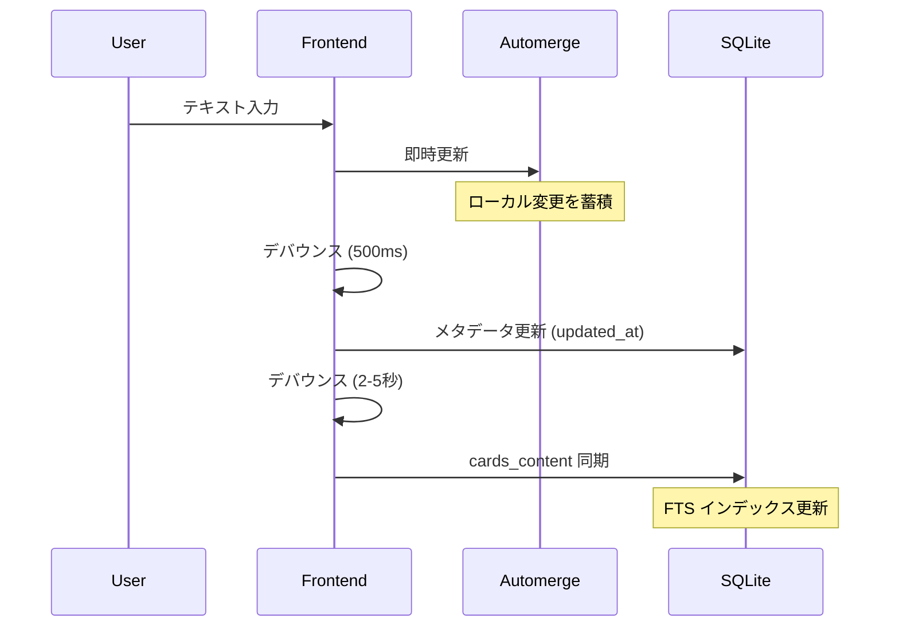
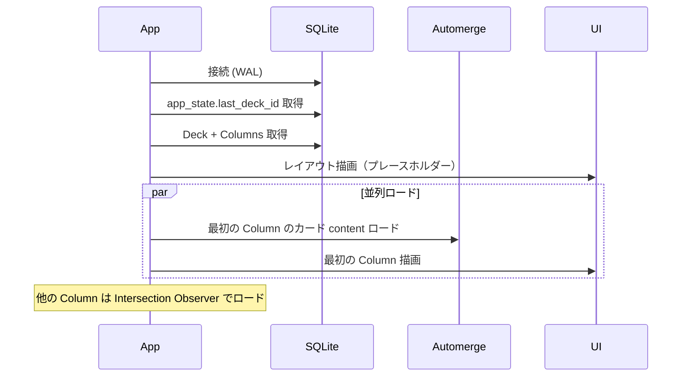
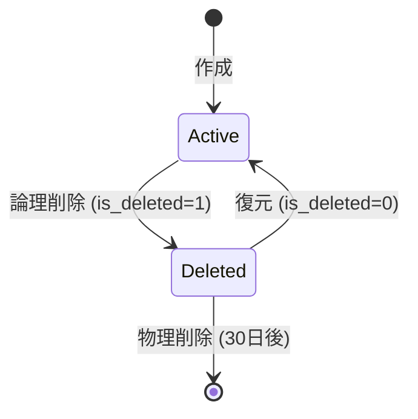

# Jot Deck データ構造・パフォーマンス設計

## 1. ローカルデータ構成

### 1.1 ディレクトリ構造

```
~/.jot-deck/
├── meta.db                    # SQLite (メタデータ + FTS)
├── settings.json              # ユーザー設定
└── docs/
    ├── {deck_id_1}.automerge  # Deck 単位の Automerge ドキュメント
    ├── {deck_id_2}.automerge
    └── ...
```

### 1.2 データ分離方針

| 保存先 | 内容 | 理由 |
|:---|:---|:---|
| **SQLite (meta.db)** | メタデータ、インデックス、FTS | 高速クエリ、トランザクション |
| **Automerge (.automerge)** | Card の content | CRDT による競合解決 |
| **JSON (settings.json)** | ユーザー設定 | 人間が読める形式 |

---

## 2. SQLite スキーマ

### 2.1 初期化設定

```sql
-- パフォーマンス設定
PRAGMA journal_mode = WAL;
PRAGMA synchronous = NORMAL;
PRAGMA foreign_keys = ON;
PRAGMA cache_size = -64000;  -- 64MB
```

### 2.2 Decks テーブル

```sql
CREATE TABLE decks (
    id TEXT PRIMARY KEY,                          -- ULID
    name TEXT NOT NULL,                           -- Deck 名
    sort_order TEXT DEFAULT 'created_at_desc',    -- ソート順設定
    created_at INTEGER NOT NULL,                  -- 作成日時 (Unix Milliseconds)
    updated_at INTEGER NOT NULL                   -- 最終更新日時
);

CREATE INDEX idx_decks_updated_at ON decks(updated_at DESC);
```

### 2.3 Columns テーブル

```sql
CREATE TABLE columns (
    id TEXT PRIMARY KEY,              -- ULID
    deck_id TEXT NOT NULL,            -- 所属 Deck ID
    name TEXT NOT NULL,               -- Column 名（表示用）
    position INTEGER NOT NULL,        -- 表示順序
    created_at INTEGER NOT NULL,      -- 作成日時 (Unix Milliseconds)
    updated_at INTEGER NOT NULL,      -- 最終更新日時
    FOREIGN KEY (deck_id) REFERENCES decks(id) ON DELETE CASCADE
);

CREATE INDEX idx_columns_deck_id ON columns(deck_id, position);
```

### 2.4 Cards テーブル

```sql
-- メタデータのみ。content は Automerge で管理。
CREATE TABLE cards (
    id TEXT PRIMARY KEY,              -- ULID
    column_id TEXT NOT NULL,          -- 所属カラムID
    score INTEGER DEFAULT 0,          -- Like数 (重要度)
    created_at INTEGER NOT NULL,      -- 作成日時 (Unix Milliseconds)
    updated_at INTEGER NOT NULL,      -- 最終更新日時
    is_deleted INTEGER DEFAULT 0,     -- 論理削除フラグ (0:Active, 1:Deleted)
    deleted_at INTEGER,               -- 削除日時（物理削除判定用）
    FOREIGN KEY (column_id) REFERENCES columns(id) ON DELETE CASCADE
);

-- カラム内カード取得（ソート済み）
CREATE INDEX idx_cards_column_id ON cards(column_id, created_at DESC)
    WHERE is_deleted = 0;

-- 削除済みカード取得（復元用）
CREATE INDEX idx_cards_deleted ON cards(deleted_at)
    WHERE is_deleted = 1;
```

### 2.5 Cards Content テーブル（FTS 用キャッシュ）

```sql
-- Automerge から定期同期される検索用スナップショット
CREATE TABLE cards_content (
    card_id TEXT PRIMARY KEY,
    content TEXT NOT NULL,
    synced_at INTEGER NOT NULL,       -- 最終同期日時
    FOREIGN KEY (card_id) REFERENCES cards(id) ON DELETE CASCADE
);

-- 全文検索用インデックス (FTS5)
CREATE VIRTUAL TABLE cards_fts USING fts5(
    content,
    content='cards_content',
    content_rowid='rowid',
    tokenize='unicode61'
);

-- FTS5 同期トリガー
CREATE TRIGGER cards_content_ai AFTER INSERT ON cards_content BEGIN
    INSERT INTO cards_fts(rowid, content) VALUES (NEW.rowid, NEW.content);
END;

CREATE TRIGGER cards_content_ad AFTER DELETE ON cards_content BEGIN
    INSERT INTO cards_fts(cards_fts, rowid, content) VALUES('delete', OLD.rowid, OLD.content);
END;

CREATE TRIGGER cards_content_au AFTER UPDATE ON cards_content BEGIN
    INSERT INTO cards_fts(cards_fts, rowid, content) VALUES('delete', OLD.rowid, OLD.content);
    INSERT INTO cards_fts(rowid, content) VALUES (NEW.rowid, NEW.content);
END;
```

### 2.6 Tags テーブル

```sql
CREATE TABLE tags (
    id TEXT PRIMARY KEY,              -- ULID
    name TEXT NOT NULL UNIQUE,        -- タグ名（#を除く）
    created_at INTEGER NOT NULL
);

CREATE INDEX idx_tags_name ON tags(name);
```

### 2.7 Card_Tags テーブル

```sql
CREATE TABLE card_tags (
    card_id TEXT NOT NULL,
    tag_id TEXT NOT NULL,
    PRIMARY KEY (card_id, tag_id),
    FOREIGN KEY (card_id) REFERENCES cards(id) ON DELETE CASCADE,
    FOREIGN KEY (tag_id) REFERENCES tags(id) ON DELETE CASCADE
);

-- タグによるカード絞り込み用
CREATE INDEX idx_card_tags_tag_id ON card_tags(tag_id);
```

### 2.8 App State テーブル

```sql
-- アプリケーション状態の永続化
CREATE TABLE app_state (
    key TEXT PRIMARY KEY,
    value TEXT NOT NULL
);

-- 格納する値の例:
-- last_deck_id: 最後に開いた Deck の ID
-- window_size: ウィンドウサイズ
-- window_position: ウィンドウ位置
```

---

## 3. Automerge ドキュメント構造

### 3.1 Deck ドキュメント

各 Deck に対して 1 つの Automerge ドキュメントを作成。

```typescript
interface DeckDocument {
  // Card ID → Card Content のマップ
  cards: {
    [cardId: string]: {
      content: Automerge.Text;  // 文字レベルでマージ可能
    };
  };
}
```

### 3.2 操作フロー



---

## 4. タグ抽出

### 4.1 抽出ルール

* パターン: `/#([a-zA-Z0-9_\u3040-\u309F\u30A0-\u30FF\u4E00-\u9FAF]+)/g`
* 日本語（ひらがな、カタカナ、漢字）対応
* アンダースコア `_` 許可
* 数字のみのタグは許可（例: `#2024`）

### 4.2 同期タイミング

```
カード保存 → タグ抽出 → tags/card_tags 更新
```

1. `cards_content` 更新時にタグを抽出
2. 既存の `card_tags` を削除
3. 抽出したタグを `tags` に UPSERT
4. `card_tags` に関連を INSERT

---

## 5. パフォーマンス設計

### 5.1 更新タイミング

| レイヤー | タイミング | 理由 |
|:---|:---|:---|
| **Automerge** | 即時（キーストローク毎） | 同期の整合性、Undo/Redo |
| **SQLite メタデータ** | デバウンス 500ms | 入力中は更新不要 |
| **FTS インデックス** | デバウンス 2-5秒 | 検索はリアルタイム不要 |
| **タグ抽出** | FTS 同期と同時 | 一貫性確保 |

### 5.2 クエリパターン

#### カード一覧取得（カーソルベース）

```sql
-- 初回
SELECT c.id, c.column_id, c.score, c.created_at, c.updated_at, cc.content
FROM cards c
LEFT JOIN cards_content cc ON c.id = cc.card_id
WHERE c.column_id = ?
  AND c.is_deleted = 0
ORDER BY c.created_at DESC
LIMIT 50;

-- 続きを取得
SELECT c.id, c.column_id, c.score, c.created_at, c.updated_at, cc.content
FROM cards c
LEFT JOIN cards_content cc ON c.id = cc.card_id
WHERE c.column_id = ?
  AND c.is_deleted = 0
  AND c.id < ?  -- ULID はソート可能
ORDER BY c.created_at DESC
LIMIT 50;
```

#### タグフィルタ

```sql
SELECT c.id, c.column_id, c.score, c.created_at, cc.content
FROM cards c
INNER JOIN card_tags ct ON c.id = ct.card_id
INNER JOIN tags t ON ct.tag_id = t.id
LEFT JOIN cards_content cc ON c.id = cc.card_id
WHERE c.column_id = ?
  AND c.is_deleted = 0
  AND t.name = ?
ORDER BY c.created_at DESC
LIMIT 50;
```

#### 全文検索

```sql
SELECT c.id, c.column_id, c.score, c.created_at, cc.content,
       highlight(cards_fts, 0, '<mark>', '</mark>') AS highlighted
FROM cards_fts
INNER JOIN cards_content cc ON cards_fts.rowid = cc.rowid
INNER JOIN cards c ON cc.card_id = c.id
WHERE cards_fts MATCH ?
  AND c.is_deleted = 0
ORDER BY rank
LIMIT 50;
```

### 5.3 起動時間最適化

| フェーズ | 対策 |
|:---|:---|
| Tauri 起動 | v2 は十分高速 |
| SQLite 接続 | WAL モード、接続プール不要（単一接続） |
| 初期データ取得 | 最後に開いた Deck の最初の Column のみ |
| Automerge ロード | 遅延ロード（Column 表示時） |
| UI 描画 | Svelte + 仮想スクロール |

**起動シーケンス:**


### 5.4 メモリ管理

| コンポーネント | 戦略 |
|:---|:---|
| **CodeMirror インスタンス** | LRU キャッシュ（最大 10 個程度） |
| **Automerge ドキュメント** | Deck 単位でロード、非アクティブ Deck はアンロード |
| **カードデータ** | 仮想スクロールで可視領域のみ保持 |
| **FTS 結果** | ページネーション、全件保持しない |

### 5.5 Tauri IPC 最適化

#### バッチ API

```rust
// カード一覧取得（バッチ）
#[tauri::command]
fn get_cards_by_column(
    column_id: String,
    cursor: Option<String>,
    limit: u32,
) -> Result<CardPage, String>;

// 複数カード更新（バッチ）
#[tauri::command]
fn update_cards(updates: Vec<CardUpdate>) -> Result<(), String>;
```

#### レスポンス構造

```typescript
interface CardPage {
  cards: Card[];
  next_cursor: string | null;  // null なら最後
  has_more: boolean;
}
```

---

## 6. 論理削除と物理削除

### 6.1 削除フロー



### 6.2 物理削除バッチ

```sql
-- 30日以上前に削除されたカードを物理削除
DELETE FROM cards
WHERE is_deleted = 1
  AND deleted_at < (strftime('%s', 'now') * 1000 - 30 * 24 * 60 * 60 * 1000);
```

実行タイミング:
* アプリ起動時（バックグラウンド）
* 1 日 1 回の定期実行

---

## 7. マイグレーション

### 7.1 バージョン管理

```sql
CREATE TABLE schema_version (
    version INTEGER PRIMARY KEY,
    applied_at INTEGER NOT NULL
);
```

### 7.2 マイグレーションファイル

```
src-tauri/migrations/
├── 001_initial.sql
├── 002_add_score.sql
└── ...
```

Rust 側で起動時にバージョンチェック → 未適用のマイグレーションを順次実行。
