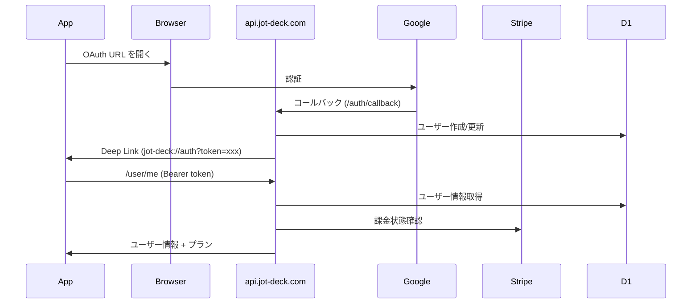

# Jot Deck 開発ロードマップ

Rust 学習と並行した段階的開発計画。

---

## Phase 0: Rust 基礎

### 目標
所有権・借用・ライフタイムの理解。プロジェクト開始前の準備フェーズ。

### 学習リソース

| リソース | 内容 |
|:---|:---|
| [The Rust Book](https://doc.rust-lang.org/book/) | 1-10章を重点的に |
| [Rustlings](https://github.com/rust-lang/rustlings) | 演習問題で手を動かす |
| 小さなCLIツール作成 | `clap` + ファイル操作 |

### 理解すべき概念

- [ ] `String` vs `&str`
- [ ] `Option<T>` と `Result<T, E>`
- [ ] `struct` と `impl`
- [ ] `Clone`, `Copy`, `Debug` トレイト
- [ ] 所有権の移動と借用
- [ ] ライフタイム注釈の基本

### 成果物
* 簡単な CLI ツール（ファイル操作）

---

## Phase 1: データ層（Tauri なし）

### 目標
SQLite + rusqlite でローカル DB を構築。CLI で動作確認。

### 実装内容

```
src/
├── main.rs          # CLI エントリポイント
├── db.rs            # rusqlite ラッパー
├── models/
│   ├── mod.rs
│   ├── deck.rs
│   ├── column.rs
│   └── card.rs
└── error.rs         # カスタムエラー型
```

### タスク

- [ ] プロジェクト初期化（`cargo new jot-deck --name jot-deck`）
- [ ] 依存関係追加（`rusqlite`, `ulid`, `thiserror`, `serde`）
- [ ] DB 接続・マイグレーション実装
- [ ] Deck CRUD
- [ ] Column CRUD
- [ ] Card CRUD
- [ ] CLI で動作確認

### 学ぶこと
* `rusqlite` の基本操作
* `thiserror` でのエラー型定義
* `serde` でのシリアライズ
* Rust のモジュールシステム

### 成果物
* CLI で Deck/Column/Card の CRUD ができる

---

## Phase 2: Tauri 統合

### 目標
Rust バックエンド + 最小限 Svelte フロントエンドの統合。

### 実装内容

```
jot-deck/
├── apps/
│   └── desktop/
│       ├── src/                   # Svelte フロントエンド
│       │   ├── App.svelte
│       │   └── lib/
│       │       └── api.ts         # Tauri invoke ラッパー
│       ├── src-tauri/
│       │   ├── src/
│       │   │   ├── main.rs
│       │   │   ├── commands/      # Tauri commands
│       │   │   ├── db/            # Phase 1 のコードを移植
│       │   │   └── state.rs
│       │   ├── Cargo.toml
│       │   └── tauri.conf.json    # identifier: com.jot-deck.app
│       └── package.json
├── packages/
│   └── ui/                        # 共通 UI コンポーネント
├── pnpm-workspace.yaml
└── turbo.json
```

### タスク

- [ ] monorepo 初期化（`pnpm init`, `pnpm-workspace.yaml`, `turbo.json`）
- [ ] Tauri + Svelte プロジェクト初期化（`apps/desktop`）
- [ ] Phase 1 のコードを `src-tauri` に移植
- [ ] Tauri State 管理（`Mutex<Connection>`）
- [ ] 基本的な Tauri Command 実装
  - [ ] `get_decks`
  - [ ] `get_columns`
  - [ ] `get_cards_by_column`
  - [ ] `create_card`
  - [ ] `update_card`
  - [ ] `delete_card`
- [ ] フロントエンドから API 呼び出し
- [ ] 最小限の UI（カード一覧表示）

### 学ぶこと
* Tauri の State 管理
* `#[tauri::command]` マクロ
* フロントエンドとの JSON やり取り
* エラーのフロントエンド伝播

### 成果物
* Tauri アプリでカード一覧が表示される

---

## Phase 3: フロントエンド本格実装

### 目標
仕様書の UI/UX を完全実装。

### 実装内容

| 機能 | 技術 |
|:---|:---|
| カード仮想スクロール | TanStack Virtual |
| エディタ | CodeMirror 6 + Vim モード |
| キーボードナビゲーション | カスタム実装 |
| コマンドパレット | カスタム実装 |
| テーマ | CSS 変数 + OS 追従 |

### タスク

- [ ] レイアウト実装（マルチカラム）
- [ ] TanStack Virtual 導入
- [ ] CodeMirror 6 統合
  - [ ] Vim モード設定
  - [ ] インスタンスプール実装
- [ ] View/Edit モード切り替え
- [ ] キーバインド実装（`001-keybindings.md` 参照）
- [ ] コマンドパレット
- [ ] タグ機能
  - [ ] `#` 補完
  - [ ] タグフィルタ
- [ ] Column 遅延ロード（Intersection Observer）
- [ ] ダーク/ライトモード
- [ ] 設定画面

### 成果物
* フル機能の UI（AI 機能除く）

---

## Phase 4: AI ストリーミング

### 目標
Gemini API 連携、ストリーミングレスポンス実装。

### 実装内容

```rust
// src-tauri/src/ai.rs
#[tauri::command]
async fn generate_draft(
    app: AppHandle,
    deck_id: String,
    prompt: String,
) -> Result<(), String> {
    let mut stream = gemini_client.stream_generate(...).await?;
    while let Some(chunk) = stream.next().await {
        app.emit("ai-chunk", chunk?)?;
    }
    app.emit("ai-complete", ())?;
    Ok(())
}
```

### タスク

- [ ] Gemini API クライアント実装（`reqwest`）
- [ ] ストリーミングレスポンス処理
- [ ] Tauri Event でフロントエンドに送信
- [ ] フロントエンドでリアルタイム描画
- [ ] AI 清書 UI
  - [ ] 対話ウィンドウ
  - [ ] 結果表示
  - [ ] カードへの取り込み
- [ ] エラーハンドリング
  - [ ] リトライ
  - [ ] 中断時の途中結果保持

### 学ぶこと
* `reqwest` でのストリーミング
* `tokio` 非同期処理
* Tauri Event システム

### 成果物
* AI 清書機能が動作

---

## Phase 5: 認証・課金

### 目標
Google OAuth + Stripe 連携。Cloudflare Workers で API を構築。

### 実装内容

```
jot-deck/
└── packages/
    └── workers/                      # api.jot-deck.com
        ├── src/
        │   ├── index.ts              # Hono エントリポイント
        │   ├── routes/
        │   │   ├── auth.ts           # /auth/* - Google OAuth
        │   │   ├── stripe.ts         # /stripe/* - Webhook, Checkout
        │   │   ├── ai.ts             # /ai/* - Gemini プロキシ
        │   │   └── user.ts           # /user/* - ユーザー情報
        │   ├── middleware/
        │   │   └── auth.ts           # JWT 検証
        │   └── db/
        │       ├── schema.sql        # D1 スキーマ
        │       └── queries.ts        # 型安全クエリ
        ├── wrangler.toml
        └── package.json
```



### D1 スキーマ

```sql
-- packages/workers/src/db/schema.sql
CREATE TABLE users (
    id TEXT PRIMARY KEY,              -- ULID
    google_id TEXT NOT NULL UNIQUE,
    email TEXT NOT NULL,
    name TEXT,
    avatar_url TEXT,
    created_at INTEGER NOT NULL,
    updated_at INTEGER NOT NULL
);

CREATE TABLE subscriptions (
    id TEXT PRIMARY KEY,              -- ULID
    user_id TEXT NOT NULL UNIQUE,
    stripe_customer_id TEXT,
    stripe_subscription_id TEXT,
    plan TEXT NOT NULL DEFAULT 'free', -- free, essential, power_user
    status TEXT NOT NULL DEFAULT 'active',
    current_period_end INTEGER,
    created_at INTEGER NOT NULL,
    updated_at INTEGER NOT NULL,
    FOREIGN KEY (user_id) REFERENCES users(id)
);

CREATE TABLE ai_usage (
    id TEXT PRIMARY KEY,
    user_id TEXT NOT NULL,
    month TEXT NOT NULL,              -- YYYY-MM
    count INTEGER NOT NULL DEFAULT 0,
    UNIQUE(user_id, month),
    FOREIGN KEY (user_id) REFERENCES users(id)
);
```

### タスク

- [ ] Cloudflare Workers プロジェクト初期化（`packages/workers`）
- [ ] Hono セットアップ
- [ ] D1 スキーマ作成・マイグレーション
- [ ] Google OAuth 実装
  - [ ] `/auth/login` - OAuth URL 生成
  - [ ] `/auth/callback` - コールバック処理
  - [ ] JWT 発行（jose）
  - [ ] Tauri Deep Link 対応（`jot-deck://auth`）
- [ ] Stripe 連携
  - [ ] `/stripe/checkout` - Checkout Session 作成
  - [ ] `/stripe/webhook` - イベント処理
  - [ ] `/stripe/portal` - カスタマーポータル URL
- [ ] ユーザー API
  - [ ] `/user/me` - ユーザー情報取得
  - [ ] `/user/usage` - AI 使用量取得
- [ ] フロントエンド
  - [ ] ログイン UI
  - [ ] アカウント設定
  - [ ] 課金管理
- [ ] Wrangler 設定（本番/ステージング環境）

### 環境変数（wrangler.toml）

```toml
name = "jot-deck-api"
main = "src/index.ts"
compatibility_date = "2024-01-01"

[[d1_databases]]
binding = "DB"
database_name = "jot-deck"
database_id = "xxx"

[vars]
GOOGLE_CLIENT_ID = ""
STRIPE_PUBLISHABLE_KEY = ""

# Secrets (wrangler secret put)
# GOOGLE_CLIENT_SECRET
# STRIPE_SECRET_KEY
# STRIPE_WEBHOOK_SECRET
# JWT_SECRET
```

### 成果物
* 認証・課金が動作する MVP 完成

---

## Phase 6: クラウド同期

### 目標
Automerge + PartyKit でリアルタイム同期。

### 学習リソース

| リソース | 内容 |
|:---|:---|
| [Automerge Docs](https://automerge.org/docs/) | CRDT の概念と API |
| [PartyKit Docs](https://docs.partykit.io/) | WebSocket サーバー |
| [CRDT.tech](https://crdt.tech/) | CRDT 理論 |

### 実装内容

```
jot-deck/
├── apps/
│   └── desktop/
│       └── src-tauri/src/
│           └── sync/
│               ├── mod.rs
│               ├── automerge.rs    # Automerge 操作
│               └── websocket.rs    # WebSocket クライアント
└── packages/
    └── partykit/                   # partykit deploy → jot-deck.partykit.dev
        ├── src/
        │   └── sync-room.ts
        └── package.json
```

### タスク

- [ ] Automerge 導入
  - [ ] Deck ドキュメント構造定義
  - [ ] SQLite との同期
- [ ] PartyKit サーバー
  - [ ] Sync Room 実装
  - [ ] R2 連携
- [ ] Tauri WebSocket クライアント
- [ ] オンライン/オフライン状態管理
- [ ] 同期 UI
  - [ ] 同期状態インジケーター
  - [ ] 競合解決（自動）
- [ ] 有料プラン限定チェック

### 成果物
* リアルタイム同期が動作

---

## 将来の Phase

### Phase 7: 全文検索
* Deck 内検索
* 全 Deck 横断検索
* 検索結果 UI

### Phase 8: macOS / Linux 対応
* プラットフォーム固有の調整
* CI/CD 設定

### Phase 9: エクスポート機能
* Markdown エクスポート
* JSON エクスポート
* PDF エクスポート

### Phase 10: 共有機能
* Deck の共有リンク生成
* 閲覧専用/編集可能の権限管理

---

## 技術的負債の管理

各 Phase 完了時にレビューする項目：

- [ ] テストカバレッジ
- [ ] エラーハンドリングの一貫性
- [ ] パフォーマンスボトルネック
- [ ] セキュリティ（特に認証周り）
- [ ] ドキュメント更新

---

## マイルストーン

| マイルストーン | 含まれる Phase | 状態 |
|:---|:---|:---|
| **ローカル動作版** | Phase 0-3 | 未着手 |
| **AI 機能付き** | Phase 4 | 未着手 |
| **MVP リリース** | Phase 5 | 未着手 |
| **同期機能リリース** | Phase 6 | 未着手 |
