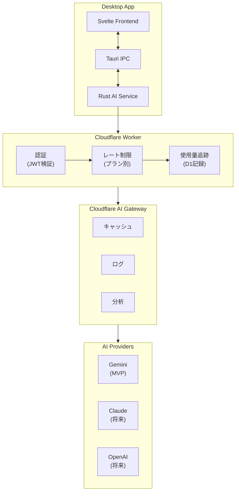

# AI 清書機能 設計書

## 概要

Jot Deck の AI 清書機能は、Deck 内のカードを読み取り、LLM が文脈を理解して統合・清書する機能です。Cloudflare AI Gateway を経由することで、複数の AI プロバイダーを統一的に扱い、認証・課金・レート制限を一元管理します。

---

## アーキテクチャ



### レイヤー責務

| レイヤー | 責務 |
|:---|:---|
| **Svelte Frontend** | UI 表示、ストリーミング結果のレンダリング、ユーザー操作 |
| **Tauri IPC** | フロントエンド ↔ Rust 間の通信 |
| **Rust AI Service** | Worker API 呼び出し、ストリーミングハンドリング、オフラインキュー |
| **Cloudflare Worker** | 認証検証、プラン別レート制限、使用量追跡 |
| **AI Gateway** | プロバイダー抽象化、キャッシュ、ログ、分析 |
| **AI Providers** | 実際の LLM 推論 |

---

## Worker API 仕様

### エンドポイント

```
POST https://api.jot-deck.com/v1/synthesize
```

### リクエスト

| フィールド | 型 | 必須 | 説明 |
|:---|:---|:---|:---|
| `cards` | `string[]` | Yes | カード内容の配列 |
| `prompt` | `string` | No | ユーザープロンプト |
| `format` | `"markdown" \| "plain" \| "bullet"` | No | 出力形式 |
| `conversation_id` | `string` | No | 会話継続用 |

### レスポンス（Server-Sent Events）

| イベント | フィールド | 説明 |
|:---|:---|:---|
| `chunk` | `content: string` | 生成テキストの断片 |
| `done` | `conversation_id`, `usage` | 完了通知とトークン使用量 |
| `error` | `code`, `message` | エラー通知 |

### 認証

```
Authorization: Bearer <jwt_token>
```

JWT クレーム: `sub`（ユーザー ID）, `plan`（プラン）, `exp`（有効期限）

### レート制限

| プラン | 月間生成回数 | 1分あたりリクエスト |
|:---|:---|:---|
| **Free** | 20 | 5 |
| **Essential** | 200 | 20 |
| **Power User** | 2,000 | 60 |

---

## AI Gateway 設定

OpenAI 互換エンドポイントを使用（プロバイダー切り替え容易化のため）：

```
https://gateway.ai.cloudflare.com/v1/{account_id}/{gateway_id}/chat/completions
```

モデル指定: `google-ai-studio/gemini-2.0-flash`

| 設定 | 値 | 説明 |
|:---|:---|:---|
| **Caching** | 有効 | 同一リクエストの再利用 |
| **Rate Limiting** | Worker 側で制御 | プラン別制限のため |
| **Logging** | 有効 | デバッグ・分析用 |

---

## エラーハンドリング

| コード | 説明 | ユーザー表示 |
|:---|:---|:---|
| `unauthorized` | 未認証 / トークン期限切れ | "Please sign in to continue." |
| `rate_limit` | レート制限超過 | "Monthly limit reached. Please upgrade your plan." |
| `network_error` | ネットワーク接続エラー | "Connection failed. Please check your network." |
| `provider_error` | AI プロバイダーエラー | "AI service temporarily unavailable. Please try again later." |
| `content_filter` | コンテンツフィルター | "Unable to process this request." |

リトライ対象: `network_error`, `provider_error`（最大 3 回、指数バックオフ）

---

## セキュリティ

| キー | 保存場所 |
|:---|:---|
| **Cloudflare API Token** | Worker 環境変数 |
| **AI Gateway ID** | Worker 環境変数 |
| **ユーザー JWT** | Tauri Secure Storage |

入力制限:
- カード内容の最大長: 100,000 文字
- プロンプトインジェクション対策（システムプロンプトの分離）

---

## 将来の拡張

- **モデル選択**: Gemini / Claude / GPT-4 の切り替え
- **Column 単位の清書**: Deck 全体ではなく Column 指定
- **会話履歴**: `conversation_id` による会話継続（有料プランのみ）

---

## 関連ドキュメント

- `000-spec.md` - 基本設計書（AI 清書機能の概要）
- `001-keybindings.md` - キーバインド（`Ctrl+Space` で清書ダイアログ）
- `003-roadmap.md` - 開発ロードマップ
- `006-auth-billing.md` - 認証・課金設計（Phase 5 で作成予定）
