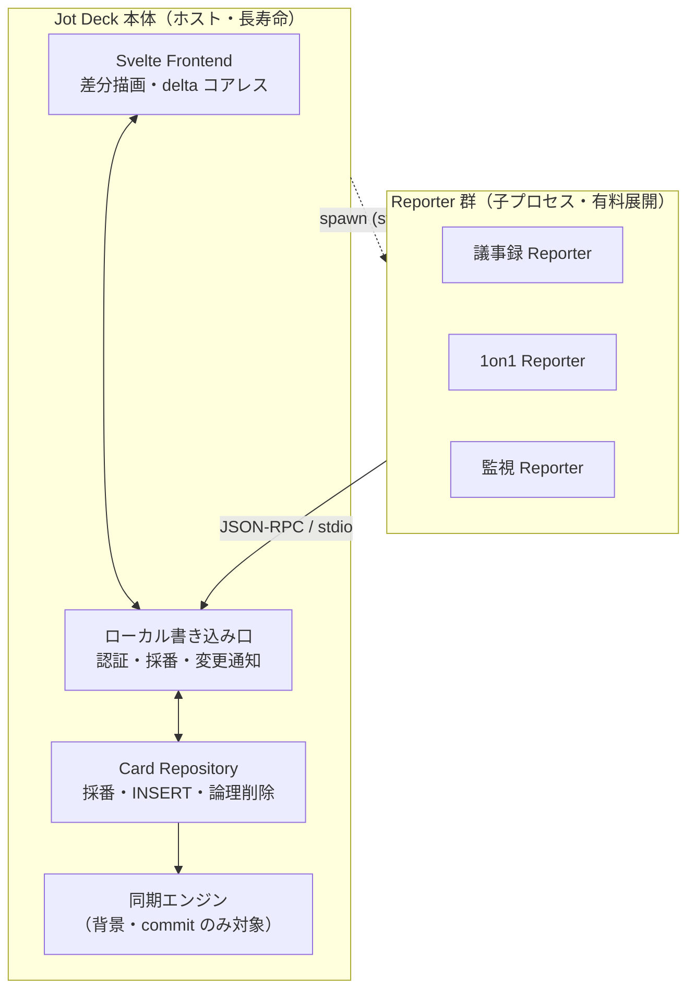

# Reporter プロトコル 設計書

## 概要

**Reporter** は、外部のドメイン入力（音声文字起こし、LLM 推論、Webhook イベントなど）をリアルタイムに解釈・分類し、Jot Deck のローカル Deck へカードとして流し込む入力アダプタである。Jot Deck 本体を共通基盤とし、ユースケースごとに独立した Reporter アプリケーションを用意する（会議議事録、1on1、営業商談、監視アラート等）。

本書は、Reporter と Jot Deck 本体の間のインターフェース（トランスポート・プロトコル・責務境界）を定義する。

> このドキュメントは構想段階の設計方針であり、実装済み仕様ではない。未確定事項は末尾「未決事項」に集約する。

---

## 1. 設計思想

### 1.1 なぜ Deck か（markdown ファイル塊との比較）

Reporter の出力先として素の markdown 群ではなく Jot Deck を採用する根拠：

- **入力時点で構造化が済む**: カラム = 分類軸、カード = tweet サイズの原子単位。RAG でいうチャンキング・分類・メタ付与を、入力の瞬間に人間/AI が肩代わりした状態になる。
- **構造的な検索・絞り込み**: FTS5・スコア・タグ・カラム所属・タイムスタンプが第一級。「スコア上位」「特定タグ」「特定カラム」を SQL 一発で引ける。
- **安定した ID（ULID）**: カードに不変 ID があるため、後からの追記・更新・出典リンクが壊れない。

### 1.2 3 つの不変制約

| 制約 | 内容 |
|:---|:---|
| **local-first を維持** | Reporter はネットワークを一切触らない。ローカル Deck に書くだけ。 |
| **高速であること** | 「Reporter が書く → 画面に出る」ホットパスに通信を挟まない。 |
| **同期は本体の責務** | クラウド同期が要るユースケースでも、同期は Jot Deck 本体が担当する。Reporter は同期の存在を知らない。 |

### 1.3 TweetDeck 思想との一致

カードは tweet サイズの短い原子単位である。Reporter は長い入力を「1 枚の成長し続けるカード」にせず、**適当な長さで区切った短いカードの連なり**として commit する（→ 5 章）。favorite（スコア）・position 順序・VirtualList はいずれも「大量の短いカード」を捌く前提の設計であり、Reporter の出力もこの世界観に従属する。

---

## 2. アーキテクチャ

### 2.1 レイヤー責務

| レイヤー | 責務 | 速さへの関与 |
|:---|:---|:---|
| **Reporter**（複数・有料） | ドメイン入力の解釈・分類・チャンキング → ローカル append。通信なし。 | ホットパス |
| **ローカル書き込み口** | 認証・採番・frontend への変更通知。Reporter と本体の境界。 | 両者の境界（ここの遅延が全体を規定） |
| **Card Repository** | ULID 発番・position 採番・論理削除。書き込みを一元化。 | ホットパス |
| **Frontend** | 外部起因の追加/更新を差分描画。delta のコアレス。 | ホットパス |
| **同期エンジン** | commit 済みカードのみを対象に背景同期。 | 背景（ホットパス外） |

> **共通基盤の注記:** 上表の**ローカル書き込み口・Card Repository・変更通知は本体の資産**であり、Reporter 専用ではない。同じ基盤を汎用エージェント向けに MCP として外部公開する姉妹設計が `008-mcp-server.md`。本書と 008 は互いに独立して読める。
>
> **トランスポートの違い:** Reporter は**ホストが spawn** するため、ホストが持つ stdio パイプ 1 本で committed / ephemeral の両チャネルを運び、ホストが書き込み口を握る（本節）。対して MCP ブリッジは **Claude が spawn** しホストがパイプを持てないため、`008` §3 では CLI 同型の**直接 DB リンク**（committed のみ、ephemeral 非対応）を採る。共有するのは core ライブラリと DB であって、到達経路は spawn 主体で変わる。

### 2.2 ホストが Reporter を spawn する

Jot Deck 本体がホストとなり、設定に基づいて各 Reporter を**子プロセスとして spawn** する（Claude Desktop の `mcpServers` と同じモデル）。この形により：

- ライフサイクルが親に従属（本体が死ねば Reporter も畳む。孤児プロセスなし）。
- 採番・INSERT を本体 Repository に一元化する制約を**アーキテクチャで強制**できる。Reporter は DB に触る手段を物理的に持たない。

---

## 3. トランスポート

### 3.1 stdio を採用（HTTP を採らない）

HTTP API である必然性はなく、Windows 対応を含めて **stdio + JSON-RPC 2.0** を採用する。

| stdio で消える問題 |
|:---|
| ポート/ファイアウォール/localhost バインド許可（Windows で特に煩雑） |
| 認証がプロセス信頼に還元される（親が spawn した子なら素性が保証、盗み書きの口がない） |
| TCP を開かないことによる攻撃面 |
| named pipe の OS 分岐（stdio は Win/Unix で挙動同一） |

### 3.2 MCP との関係

トランスポート層は MCP にならう。準拠レベルは以下のトレードオフで決める（→ 未決事項）：

| | MCP に "ならう"（独自メソッド） | フル MCP 準拠 |
|:---|:---|:---|
| append の自然さ | ◎ notification 中心で綺麗 | △ tool/notification を仕様に合わせる |
| 実装コスト | 低 | 中 |
| 他 MCP ホストからの再利用 | × | ◎（Reporter が汎用ドメインイベント源に格上げ） |

サードパーティに Reporter/レシピを作らせてエコシステム化する事業方針を採るなら、初手からフル MCP 準拠に投資する価値がある。内製に留めるなら「ならう」だけで足りる。**フル MCP 準拠が本当に要るのは汎用エージェント境界だけ**で、そこは本書ではなく `008-mcp-server.md` が扱う（Reporter 実装には不要）。

---

## 4. 2 チャネルモデル

「表示中の作業状態」と「確定した状態」を別チャネルで扱う。これが速度・同期単純性・耐障害性を同時に成立させる中核。

| | 確定チャネル（committed） | ストリームチャネル（ephemeral） |
|:---|:---|:---|
| 例 | append、担当者付与、最終テキスト確定 | 文字起こしの逐次更新、LLM 推論の途中表示 |
| 頻度 | 低 | 高（毎秒数十〜） |
| SQLite | 書く（＝真実） | **書かない**（メモリ上のオーバーレイ） |
| 同期 | 乗る | **乗らない** |
| プロトコル形 | request/response（ack と id が要る） | notification（片方向・投げっぱなし） |
| 消えたら | 困る → 永続 | 困らない → 揮発でよい |

**同期ログには commit しか流れない。** 数千の途中 delta は同期エンジンから完全に不可視であり、「append/edit 主体 → INSERT 中心 → ULID により衝突なし」という同期の単純性が保たれる。

---

## 5. カード長制約（commit 制約）

**Reporter は、適当な長さでカードを commit しなければならない**（具体的な長さは未決）。長い入力は「1 枚の成長するカード」ではなく「短いカードの連なり」になる。

この制約がもたらす帰結：

- **耐障害性が制約で担保される**: 未確定ウィンドウが常に小さいため、クラッシュ時の損失は「書きかけの 1 枚の短いカード」に限定。別途チェックポイントを仕込む必要がない → ストリームは純メモリで最軽量。
- **append-mostly が強化される**: 支配的動作が短いカードの append に戻り、同期が楽になる。同一カードへの高頻度 edit は 1 枚の短命カードの内側だけに閉じ込められる。
- **メモリ/描画コストが自己制限的**: オーバーレイのバッファがカード長で上限を持つ。
- **TweetDeck 思想と一致**（→ 1.3）。

### 5.1 長さを決めるときの次元

- **何で刻むか**: 文字数（ハードキャップ）／意味境界（発話・文・話者ターン・沈黙）／時間窓。**意味境界を主・文字数ハードキャップを backstop** の二段が現実的。
- **誰が保証するか**: 一義的には Reporter の責務。ただし行儀の悪い Reporter が commit せず delta を垂れ流すのを防ぐため、本体に **「max open length / max open duration 超過で強制 commit or エラー」の backstop** を置く。
- **刻みロジック＝ Reporter の価値**: どこで 1 枚に切るか（話者交代？沈黙？決定確定？）は完全にドメイン固有であり、各 Reporter の差別化の中核。薄い文字起こしラッパーとの差はここで出る。

---

## 6. プロトコルメソッド

Read/Edit が発生し得るため、純 notification ではなく**双方向 JSON-RPC**になる（両ピアが request も notification も出せる）。

### 6.1 確定チャネル（request/response）

| メソッド | 方向 | 説明 |
|:---|:---|:---|
| `card.append` | Reporter → 本体 | カード新規作成。本体が採番し **ULID を返す**。Reporter は以降この id を握る。 |
| `card.patch` / `card.commit` | Reporter → 本体 | 確定 edit。永続 + 同期に乗る。 |
| `card.read` | Reporter → 本体 | 既存カードの読み返し（文脈把握・過去カードの更新対象特定）。 |
| `deck.query` | Reporter → 本体 | カラム構成・直近カード等の問い合わせ。 |

### 6.2 ストリームチャネル（notification）

| メソッド | 方向 | 説明 |
|:---|:---|:---|
| `card.stream.begin(id)` | Reporter → 本体 | ストリーム開始。対象カードを Reporter 所有としてロック。 |
| `card.stream.delta(id, chunk)` | Reporter → 本体 | 途中経過。本体は frontend にそのまま流すのみ。**DB は触らない**。 |
| `card.stream.end(id)` | Reporter → 本体 | ストリーム終了。この時点で確定チャネルに落とす（commit）。 |

ライフサイクルは短命・周期的： `begin → delta… → commit →（次の）begin`。

---

## 7. 並行性とカード所有権

Reporter が delta を流し込む最中のユーザ手編集は衝突する。カード編集の競合制御（占有ロック・楽観ロック）は `002-data-structure.md` §5 に一元定義される。本節はその Reporter における具体化：`stream.begin`〜`end` の間、対象カードは**その Reporter の占有**（`002` §5.2 の `locked_by`）とみなす。

- ユーザ編集をロック、または「◍ AI 生成中」として視覚化。
- 既存の focus model（column / card / edit / command）に、**streaming（read-only 表示）状態**を追加するイメージ。
- `stream.begin` でロック取得、`end`（commit）で解放。放棄・クラッシュ時は `002` §5.2 のリース失効で回収する（→ 5 章の max open duration backstop と同根）。

position 採番はユーザ手編集と AI 追記が同じカラム末尾を奪い合うため、**本体 Repository に一元化**（Reporter に採番させない）。

---

## 8. パフォーマンス規律

大量 edit / 高頻度 delta に対して速さを守る 3 規律：

1. **1 delta = 1 描画にしない**: frontend 側で delta を animation frame 単位（~60fps）or カード id 単位でコアレスし、まとめて再描画。
2. **1 delta = 1 SQLite write にしない**: delta はメモリのオーバーレイに当てるのみ。ディスクは commit 時だけ。書き込み増幅をゼロに抑える。
3. **VirtualList を効かせる**: 画面外でストリーム中のカードは delta を溜めるだけでレイアウトさせない。可視カードのみ描画。

---

## 9. ユースケース（Reporter 製品ライン）

共通構造は「外部エージェントが、原子的で分類可能なアイテムを連続生成し、Deck のカラム/カードへ流し込む」。カラム定義とプロンプトの差し替えで新 Reporter を量産できる。

### 9.1 会話・発話系（文字起こし + 分類 LLM が共通エンジン）
- 会議議事録: `決定事項` `ToDo` `論点・未決` `質問`
- 1on1 / 面談: `合意事項` `フォローアップ` `懸念` `次回話す`
- 営業商談: `顧客ニーズ` `反論` `次アクション` `決裁者情報`
- カスタマーサポート通話 / 医療問診 / ユーザーリサーチ

### 9.2 監視・イベントストリーム系（文字起こし不要・Webhook 受信のみ・実装が軽い）
- ログ/アラート、CI/CD、市場/ニュース監視、SNS/ブランド言及

### 9.3 個人の思考・入力系
- 音声メモ、リーディング/クリッピング、AI エージェントのタスクログ

### 9.4 事業上の要点

- **共通基盤 = 認証付きローカル書き込み口 + リアルタイム反映 + カラムテンプレート**。
- **課金**: Reporter 単位サブスク／カラムテンプレート（レシピ）のマーケットプレイス／LLM 従量。
- **堀**: ① 蓄積 Deck データ上の検索・想起・キーバインド体験（本体の粘着性）、② レシピのエコシステム、③ local-first であること自体（機密性の高い会議・医療・法務での「クラウドに残らない」プライバシー・プレミアム）。
- 逆に、**本体が「貯めて使う体験」として強くないと、Reporter は文字起こし分類ツールの寄せ集めに堕す**。基盤の価値が Reporter の価値を規定する。

---

## 10. 未決事項

| 項目 | 内容 |
|:---|:---|
| **カード長の定義** | 刻み基準（意味境界／文字数／時間窓）と backstop 値（max open length / duration）。→ 5.1 |
| **MCP 準拠レベル** | 一次 Reporter は「ならう」で足りる。汎用エージェント向けのフル MCP 準拠は `008-mcp-server.md` に分離（採用済み）。→ 3.2 |
| **同期メタのスキーマ** | 後付け同期のため、各カードに更新ベクタ（`updated_at` / device id / version）を先行投入するか。後から足すと高コスト。 |
| **frontend の外部変更 push** | 現 UI が外部起因のカード追加/更新を差分描画できる作りか要確認。 |
| **認証スコープ** | stdio で素性は保証されるが、Reporter ごとに書けるカラム/デッキを制限するスコープを設けるか。 |

---

## 11. 関連ドキュメント

- `000-spec.md` - 基本設計書（カード・カラム・Deck の概念）
- `001-keybindings.md` - キーバインドと focus model（streaming 状態の追加先）
- `002-data-structure.md` - データモデルと論理削除（同期メタの追加先）
- `008-mcp-server.md` - 同じ本体基盤を汎用エージェント（Claude 等）向けに MCP として外部公開する姉妹設計（本書とは独立に読める）
