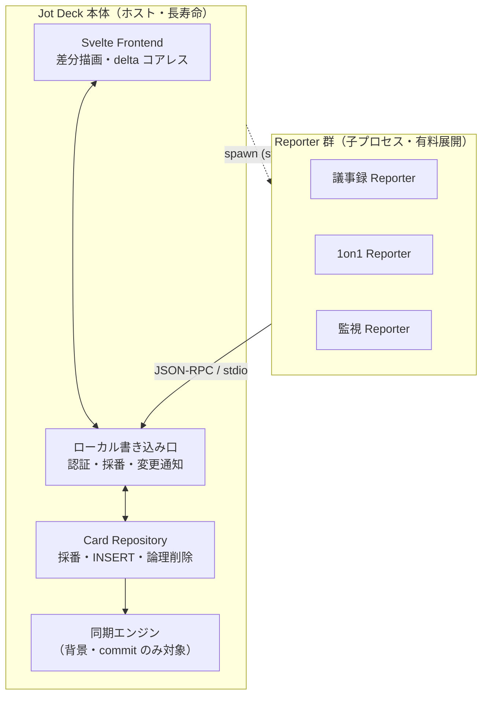

# Reporter プロトコル 設計書

## 概要

**Reporter** は、外部のドメイン入力（音声文字起こし、LLM 推論、Webhook イベントなど）をリアルタイムに解釈・分類し、Jot Deck のローカル Deck へカードとして流し込む入力アダプタである。Jot Deck 本体を共通基盤とし、ユースケースごとに独立した Reporter アプリケーションを用意する（会議議事録、1on1、営業商談、監視アラート等）。

本書は、Reporter と Jot Deck 本体の間のインターフェース（トランスポート・プロトコル・責務境界）を定義する。

> このドキュメントは構想段階の設計方針であり、実装済み仕様ではない。未確定事項は末尾「未決事項」に集約する。

---

## 1. 設計思想

### 1.1 なぜ Deck か（markdown ファイル塊との比較）

Reporter の出力先として素の markdown 群ではなく Jot Deck を採用する根拠：

- **入力時点で構造化が済む**: カラム = 分類軸、カード = tweet サイズの原子単位。RAG でいうチャンキング・分類・メタ付与を、入力の瞬間に人間/AI が肩代わりした状態になる。
- **構造的な検索・絞り込み**: FTS5・スコア・タグ・カラム所属・タイムスタンプが第一級。「スコア上位」「特定タグ」「特定カラム」を SQL 一発で引ける。
- **安定した ID（ULID）**: カードに不変 ID があるため、後からの追記・更新・出典リンクが壊れない。

### 1.2 3 つの不変制約

| 制約 | 内容 |
|:---|:---|
| **local-first を維持** | Reporter はネットワークを一切触らない。ローカル Deck に書くだけ。 |
| **高速であること** | 「Reporter が書く → 画面に出る」ホットパスに通信を挟まない。 |
| **同期は本体の責務** | クラウド同期が要るユースケースでも、同期は Jot Deck 本体が担当する。Reporter は同期の存在を知らない。 |

### 1.3 TweetDeck 思想との一致

カードは tweet サイズの短い原子単位である。Reporter は長い入力を「1 枚の成長し続けるカード」にせず、**適当な長さで区切った短いカードの連なり**として commit する（→ 5 章）。favorite（スコア）・position 順序・VirtualList はいずれも「大量の短いカード」を捌く前提の設計であり、Reporter の出力もこの世界観に従属する。

---

## 2. アーキテクチャ

### 2.1 レイヤー責務

| レイヤー | 責務 | 速さへの関与 |
|:---|:---|:---|
| **Reporter**（複数・有料） | ドメイン入力の解釈・分類・チャンキング → ローカル append。通信なし。 | ホットパス |
| **ローカル書き込み口** | 認証・採番・frontend への変更通知。Reporter と本体の境界。 | 両者の境界（ここの遅延が全体を規定） |
| **Card Repository** | ULID 発番・position 採番・論理削除。書き込みを一元化。 | ホットパス |
| **Frontend** | 外部起因の追加/更新を差分描画。delta のコアレス。 | ホットパス |
| **同期エンジン** | commit 済みカードのみを対象に背景同期。 | 背景（ホットパス外） |

> **共通基盤の注記:** 上表の**ローカル書き込み口・Card Repository・変更通知は本体の資産**であり、Reporter 専用ではない。同じ基盤を汎用エージェント向けに MCP として外部公開する姉妹設計が `008-mcp-server.md`。本書と 008 は互いに独立して読める。
>
> **トランスポートの違い:** Reporter は**ホストが spawn** するため、ホストが持つ stdio パイプ 1 本で committed / ephemeral の両チャネルを運び、ホストが書き込み口を握る（本節）。対して MCP ブリッジは **Claude が spawn** しホストがパイプを持てないため、`008` §3 では CLI 同型の**直接 DB リンク**（committed のみ、ephemeral 非対応）を採る。共有するのは core ライブラリと DB であって、到達経路は spawn 主体で変わる。

### 2.2 ホストが Reporter を spawn する

Jot Deck 本体がホストとなり、設定に基づいて各 Reporter を**子プロセスとして spawn** する（Claude Desktop の `mcpServers` と同じモデル）。この形により：

- ライフサイクルが親に従属（本体が死ねば Reporter も畳む。孤児プロセスなし）。
- 採番・INSERT を本体 Repository に一元化する制約を**アーキテクチャで強制**できる。Reporter は DB に触る手段を物理的に持たない。

**一次 Reporter もサードパーティ Reporter も、等しく本体が spawn する。** サードパーティ製は、power-user がバイナリのフルパスを設定に登録し、本体がそれを spawn する（Claude Desktop の `mcpServers` 登録と同じ操作）。したがってサードパーティ Reporter も一次実装と**同一のトランスポート（stdio + Reporter プロトコル）と両チャネル（committed / ephemeral）**を得る。§4 のストリーミング体験はサードパーティにも等しく開かれる。MCP 経由（`008`）とは異なる到達経路である点に注意（→ §3.2）。

ただし **spawn が保証するのはプロセスの親子関係だけ**であり、登録バイナリの素性・挙動の良性までは保証しない（悪意ある/汚染されたバイナリが登録され得る）。したがって**識別と書き込み権限のセキュリティ境界は spawn ではなく per-Reporter 認証（§10 の認証スコープ）**が担う。§3.1 が言う「プロセス信頼」は「TCP を開かず盗み書きの口がない」という**トランスポート面の性質**であって、登録バイナリを信頼してよいという意味ではない。

---

## 3. トランスポート

### 3.1 stdio を採用（HTTP を採らない）

HTTP API である必然性はなく、Windows 対応を含めて **stdio + JSON-RPC 2.0** を採用する。

| stdio で消える問題 |
|:---|
| ポート/ファイアウォール/localhost バインド許可（Windows で特に煩雑） |
| トランスポート面の信頼が spawn に還元される（親が spawn した子への stdio は他プロセスから盗み書きできない）。※登録バイナリの良性はこれでは保証されず、識別・書き込み権限は per-Reporter 認証で担保する（→ §10） |
| TCP を開かないことによる攻撃面 |
| named pipe の OS 分岐（stdio は Win/Unix で挙動同一） |

### 3.2 MCP との関係

Reporter のトランスポートは MCP にならった**独自メソッド**（§6）とする。append が notification 中心で自然に書け、実装コストが低い。**フル MCP 準拠が要るのは汎用エージェント境界だけ**で、そこは本書ではなく `008-mcp-server.md` が扱う（Reporter 実装には不要）。

**サードパーティ Reporter もフル MCP を前提としない。** 第三者製も本体 spawn（§2.2）で Reporter プロトコルをそのまま話すため、MCP 準拠は不要。エコシステム開放に必要なのは「プロトコルの文書化 + 配管 SDK の提供」（§9.5）であって、MCP への書き換えではない。**別なのは transport/protocol トラックだけ**である ―― MCP(`008`) は Claude が spawn する汎用エージェント境界で到達経路が違うが、**core ライブラリ・DB・認証スコープ契約（`private` 除外を含む書き込み権限モデル）は Reporter と共有する**（§2.1）。両者を別トラックとして扱うのは到達経路の分離のためであり、認証セマンティクスを分岐させてはならない。

---

## 4. 2 チャネルモデル

「表示中の作業状態」と「確定した状態」を別チャネルで扱う。これが速度・同期単純性・耐障害性を同時に成立させる中核。

| | 確定チャネル（committed） | ストリームチャネル（ephemeral） |
|:---|:---|:---|
| 例 | append、担当者付与、最終テキスト確定 | 文字起こしの逐次更新、LLM 推論の途中表示 |
| 頻度 | 低 | 高（毎秒数十〜） |
| SQLite | 書く（＝真実） | **書かない**（メモリ上のオーバーレイ） |
| 同期 | 乗る | **乗らない** |
| プロトコル形 | request/response（ack と id が要る） | 途中経過（`delta`）は notification（片方向・投げっぱなし）。開始/終了の境界はロック取得・commit を伴うため request/response（→ §6.2） |
| 消えたら | 困る → 永続 | 困らない → 揮発でよい |

**同期ログには commit しか流れない。** 数千の途中 delta は同期エンジンから完全に不可視であり、「append/edit 主体 → INSERT 中心 → ULID により衝突なし」という同期の単純性が保たれる。

---

## 5. カード長制約（commit 制約）

**Reporter は、適当な長さでカードを commit しなければならない**（具体的な長さは未決）。長い入力は「1 枚の成長するカード」ではなく「短いカードの連なり」になる。

この制約がもたらす帰結：

- **耐障害性が制約で担保される**: 未確定ウィンドウが常に小さいため、クラッシュ時の損失は「書きかけの 1 枚の短いカード」に限定。別途チェックポイントを仕込む必要がない → ストリームは純メモリで最軽量。
- **append-mostly が強化される**: 支配的動作が短いカードの append に戻り、同期が楽になる。同一カードへの高頻度 edit は 1 枚の短命カードの内側だけに閉じ込められる。
- **メモリ/描画コストが自己制限的**: オーバーレイのバッファがカード長で上限を持つ。
- **TweetDeck 思想と一致**（→ 1.3）。

### 5.1 長さを決めるときの次元

- **何で刻むか**: 文字数（ハードキャップ）／意味境界（発話・文・話者ターン・沈黙）／時間窓。**意味境界を主・文字数ハードキャップを backstop** の二段が現実的。
- **誰が保証するか**: 一義的には Reporter の責務。ただし行儀の悪い Reporter が commit せず delta を垂れ流すのを防ぐため、本体に **「max open length / max open duration 超過で強制 commit or エラー」の backstop** を置く。
- **刻みロジック＝ Reporter の価値**: どこで 1 枚に切るか（話者交代？沈黙？決定確定？）は完全にドメイン固有であり、各 Reporter の差別化の中核。薄い文字起こしラッパーとの差はここで出る。

---

## 6. プロトコルメソッド

Read/Edit が発生し得るため、純 notification ではなく**双方向 JSON-RPC**になる（両ピアが request も notification も出せる）。

### 6.1 確定チャネル（request/response）

| メソッド | 方向 | 説明 |
|:---|:---|:---|
| `card.append` | Reporter → 本体 | カード新規作成。本体が採番し **ULID を返す**。Reporter は以降この id を握る。 |
| `card.patch` / `card.commit` | Reporter → 本体 | 確定 edit。永続 + 同期に乗る。 |
| `card.move` | Reporter → 本体 | カードのカラム間移動 / 並べ替え。アンカー（`before_card_id` / `after_card_id`、どちらか一方。省略時は移動先末尾）で意図を表明し、position は本体が採番。移動先は接続 Deck 内のカラムに限る。 |
| `card.delete` | Reporter → 本体 | カードを論理削除（復元可能）。物理削除・復元はユーザの削除スタックと cleanup に委ねる。 |
| `card.read` | Reporter → 本体 | 既存カードの読み返し（文脈把握・過去カードの更新対象特定）。 |
| `deck.query` | Reporter → 本体 | カラム構成・直近カード等の問い合わせ。 |
| `column.ensure` | Reporter → 本体 | 名前キーで get-or-create（べき等）。可視範囲に同名カラムがあれば取得、無ければ末尾に作成し、本体が採番した **ULID を返す**（`{ column_id, name, position, created }`）。 |
| `column.update` | Reporter → 本体 | カラムの `name` / `description` / `private` を更新（指定分のみ）。 |
| `column.move` | Reporter → 本体 | カラムの並べ替え。アンカー（`before_column_id` / `after_column_id`、どちらか一方。省略時は末尾）で意図を表明し、position は本体が採番。 |

`card.*` / `column.*` はいずれも request/response で、**ID / position の採番は本体が一元化**（§7）。カード・カラムの順序は生の position ではなく「どのカード/カラムの前/後」という**アンカー**で表明する。Reporter は append を主としつつ（§1.3 の append-mostly）、既存カードの再配置（`card.move`）と論理削除（`card.delete`）も行える ―― これらは姉妹設計 `008-mcp-server.md` §4.1 が汎用エージェントへ公開する `move_card` / `delete_card` と**同じ core を 007 トランスポートで叩く**（§2.1 の共有 core）。書き込みスコープ（§10）は `card.delete` を独立の権限として扱える。

#### 6.1.1 構造メソッド（カラムの作成 / 再編）

`column.ensure` / `column.update` / `column.move` は、姉妹設計 `008-mcp-server.md` §4.1 が汎用エージェントへ公開する `ensure_column` / `update_column` / `move_column` と**対**であり、**同じ core（`jot_deck_core::write`）を 007 トランスポートで叩く**（§2.1 の共有 core・DB。到達経路＝spawn 主体だけが違う）。

- **`column.ensure` が Reporter の自前プロビジョニングを可能にする。** name キーの get-or-create なので、Reporter はテンプレートのカラム（§9：会議議事録なら `決定事項` `ToDo` 等）を**起動時に自分で用意**する。再送・再起動でも同名は既存を返すため列が重複しない。
- **構造再編もランタイムで行える。** 分類軸の変更（`column.update` の `description` 書き換え）やカラム順の入れ替え（`column.move`）を、カード追記と同じ確定チャネルで表明する。
- **008 の外部エージェント向け絞り込みは持ち込まない。** `idempotency_key`（§5）・write allowlist・capability といった 008 §4.5/§5 の防具は汎用エージェント境界の関心事。Reporter は本体 spawn の信頼境界内で動く（§3.1）ため、これらはメソッド引数に出さない。ただし**サードパーティ Reporter の per-Reporter 書き込みスコープ（§10 の認証スコープ）は、カード書き込みと同様この構造メソッドにも本体側で適用される** ―― `private` カラムへの読み書き禁止を含む（§10）。

### 6.2 ストリームチャネル

独自プロトコルなので「ストリーム＝ notification」には縛られない。notification なのは**高頻度で揮発してよい途中経過（`delta`）だけ**。ストリームを開く/閉じる境界はロック取得・commit という**確定状態の変更**を伴うため request/response とし、失敗（ロック競合・commit エラー）を必ず呼び出し側へ返す。

| メソッド | 方向 | 形 | 説明 |
|:---|:---|:---|:---|
| `card.stream.begin(id)` | Reporter → 本体 | request/response | ストリーム開始。対象カードを Reporter 所有としてロック取得し、**取得可否（成功／競合エラー）を返す**。ack を得るまで `delta` を送らない。 |
| `card.stream.delta(id, chunk)` | Reporter → 本体 | notification | 途中経過。本体は frontend にそのまま流すのみ。**DB は触らない**。片方向・投げっぱなし。 |
| `card.stream.end(id)` | Reporter → 本体 | request/response | ストリーム終了。確定チャネルに落とし（commit）、**commit 結果（`updated_at` 等）またはエラーを返して成功時にロックを解放**する。 |

ライフサイクルは短命・周期的： `begin(ack) → delta… → end(commit) →（次の）begin`。境界の 2 メソッドだけが確定応答を持ち、間の `delta` は揮発する。

---

## 7. 並行性とカード所有権

Reporter が delta を流し込む最中のユーザ手編集は衝突する。カード編集の競合制御（占有ロック・楽観ロック）は `002-data-structure.md` §5 に一元定義される。本節はその Reporter における具体化：`stream.begin`〜`end` の間、対象カードは**その Reporter の占有**（`002` §5.2 の `locked_by`）とみなす。

- ユーザ編集をロック、または「◍ AI 生成中」として視覚化。
- 既存の focus model（column / card / edit / command）に、**streaming（read-only 表示）状態**を追加するイメージ。
- `stream.begin` の応答でロック取得可否が返り（競合時はエラー → ストリームを始めない）、`end`（commit）の応答で確定結果を受けてロックを解放する。放棄・クラッシュ時は `002` §5.2 のリース失効で回収する（→ 5 章の max open duration backstop と同根）。

position 採番はユーザ手編集と AI 追記が同じカラム末尾を奪い合うため、**本体 Repository に一元化**（Reporter に採番させない）。

---

## 8. パフォーマンス規律

大量 edit / 高頻度 delta に対して速さを守る 3 規律：

1. **1 delta = 1 描画にしない**: frontend 側で delta を animation frame 単位（~60fps）or カード id 単位でコアレスし、まとめて再描画。
2. **1 delta = 1 SQLite write にしない**: delta はメモリのオーバーレイに当てるのみ。ディスクは commit 時だけ。書き込み増幅をゼロに抑える。
3. **VirtualList を効かせる**: 画面外でストリーム中のカードは delta を溜めるだけでレイアウトさせない。可視カードのみ描画。

---

## 9. ユースケース（Reporter 製品ライン）

共通構造は「外部エージェントが、原子的で分類可能なアイテムを連続生成し、Deck のカラム/カードへ流し込む」。カラム定義とプロンプトの差し替えで新 Reporter を量産できる。**各 Reporter は自分のカラムテンプレートを起動時に `column.ensure` でプロビジョニングする**（§6.1.1）ため、テンプレートは Reporter が持つドメイン資産として完結する。

### 9.1 会話・発話系（文字起こし + 分類 LLM が共通エンジン）
- 会議議事録: `決定事項` `ToDo` `論点・未決` `質問`
- 1on1 / 面談: `合意事項` `フォローアップ` `懸念` `次回話す`
- 営業商談: `顧客ニーズ` `反論` `次アクション` `決裁者情報`
- カスタマーサポート通話 / 医療問診 / ユーザーリサーチ

### 9.2 監視・イベントストリーム系（文字起こし不要・Webhook 受信のみ・実装が軽い）
- ログ/アラート、CI/CD、市場/ニュース監視、SNS/ブランド言及

### 9.3 個人の思考・入力系
- 音声メモ、リーディング/クリッピング、AI エージェントのタスクログ

### 9.4 事業上の要点

- **共通基盤 = 認証付きローカル書き込み口 + リアルタイム反映 + カラムテンプレート**。
- **課金**: Reporter 単位サブスク／カラムテンプレート（レシピ）のマーケットプレイス／LLM 従量。
- **堀**: ① 蓄積 Deck データ上の検索・想起・キーバインド体験（本体の粘着性）、② レシピのエコシステム、③ local-first であること自体（機密性の高い会議・医療・法務での「クラウドに残らない」プライバシー・プレミアム）。
- 逆に、**本体が「貯めて使う体験」として強くないと、Reporter は文字起こし分類ツールの寄せ集めに堕す**。基盤の価値が Reporter の価値を規定する。

### 9.5 配管の共有と SDK 化

Reporter の価値はチャンキング（§5.1）と分類（§9）にあり、**トランスポート配管——stdio 上の JSON-RPC、`stream.begin/delta/end` の状態機械（§6.2）、backstop 遵守（§5）——は全 Reporter 共通で、それ自体は価値を持たない**。この配管を独立パッケージに切り出し、各 Reporter はそれを土台にドメイン部分だけ書く。§9 冒頭の「カラム定義とプロンプトの差し替えで量産」は、この切り出しがあって初めて成立する。

- **一次実装は Python**。文字起こし・LLM 系（§9.1）のエコシステムが Python ネイティブであり、サードパーティも同言語を採りやすい。配管パッケージも Python から用意し、一次 Reporter のトランスポート層をそのまま独立パッケージ化する（これは言語選択の理由であって、後述のライセンス境界の担保手段ではない）。
- **ライセンス境界はパッケージ分離で担保する**。本体は AGPL-3.0、Reporter はクローズド／商用もあり得る（§2.1 の「有料」）。両者が共有するのは AGPL の core ではなく、この**配管パッケージ（permissive: MIT / Apache-2.0）とプロトコル仕様**だけ、という**境界を明示的に維持**する。境界の実効性は言語では保証されない（Python も PyO3 / Maturin / CFFI / ctypes / C ABI で Rust をリンクし得る）ため、**パッケージ境界・ビルドメタデータ・provenance・依存/ライセンスチェック（配管パッケージが AGPL の core に依存しないことの CI 検証）**で担保する。
- **SDK への昇格**は、プロトコルが一次 Reporter で枯れ、外部提供したくなった時点で「ドキュメント整備 + publish + サンプル」を足すだけ。§3.2 の通りフル MCP 準拠は前提ではないため、昇格に重い書き換えを伴わない。配管 SDK が Reporter エコシステム開放の唯一の入口となる。

---

## 10. 未決事項

| 項目 | 内容 |
|:---|:---|
| **カード長の定義** | 刻み基準（意味境界／文字数／時間窓）と backstop 値（max open length / duration）。→ 5.1 |
| **MCP 準拠レベル** | 一次・サードパーティとも Reporter は「ならう」で足りる（いずれも本体 spawn・Reporter プロトコル）。フル MCP は汎用エージェント向けの `008-mcp-server.md` に分離（採用済み）で、Reporter エコシステムの前提ではない。→ 3.2 |
| **同期メタのスキーマ** | 後付け同期のため、各カードに更新ベクタ（`updated_at` / device id / version）を先行投入するか。後から足すと高コスト。 |
| **frontend の外部変更 push** | 現 UI が外部起因のカード追加/更新を差分描画できる作りか要確認。 |
| **認証スコープ** | **サードパーティ Reporter が存在する時点で必須**（採用済み）。本体 spawn は「自分が起動した」ことしか保証せず、登録バイナリの良性はユーザ登録に依存する（§2.2 の power-user 割り切り）。悪意ある登録 Reporter が任意カラムへ書けるのを防ぐため、Reporter ごとに書けるカラム/デッキを制限するスコープを設ける。`private=true` カラムは読み書きとも常に拒否する（`002` の `private` カラム定義 / `008` §4.5 の既存不変条件を追認）。**未決は追加スコープのスキーマと粒度**（デッキ単位か・カラム単位か・追加の読み取り制限）。 |

---

## 11. 関連ドキュメント

- `000-spec.md` - 基本設計書（カード・カラム・Deck の概念）
- `001-keybindings.md` - キーバインドと focus model（streaming 状態の追加先）
- `002-data-structure.md` - データモデルと論理削除（同期メタの追加先）
- `008-mcp-server.md` - 同じ本体基盤を汎用エージェント（Claude 等）向けに MCP として外部公開する姉妹設計（本書とは独立に読める）
