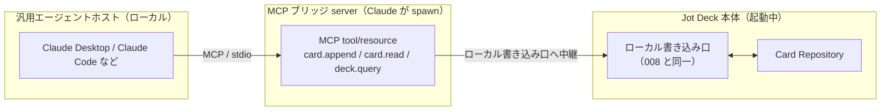

# Jot Deck MCP サーバ 設計書

## 概要

Jot Deck 本体は、自身の Deck に対する **書き込み・読み出し操作を MCP サーバとして公開**する。これにより Claude（Claude Desktop / Claude Code）をはじめとする汎用エージェントが、標準 MCP クライアントとして Deck に接続し、カードを書き込み・読み出しできる。

本書は「Jot Deck 本体を汎用エージェントに開く」外向きの関心事を扱う。内向きの専用 Reporter プロトコル（`007-reporter-protocol.md`）とは対をなすが、関心が異なる別レイヤーである。

> このドキュメントは構想段階の設計方針であり、実装済み仕様ではない。

---

## 1. 方向性 ―― Deck を開く、が正しい像

MCP は「**サーバが tool/resource を公開し、ホスト（Claude 等）がそれを呼ぶ**」構造である。Reporter とエージェントをつなぐ絵は 2 通りあり得るが、意味があるのは片方だけ。

- **✗ エージェントが Reporter を "消費する"**: Reporter は分類済みイベントを能動的に生成して push する**プロデューサ**であり、エージェントが呼び出す受動的な tool 提供者ではない。この向きは無意味。
- **◎ エージェントが Deck に書く / 読む**: **Deck 側が write/read を MCP サーバとして公開し、エージェントがそのクライアントになる**。このときエージェントは「汎用 LLM で駆動される Reporter」として振る舞う。

したがって本設計の要諦は **「Deck を汎用エージェントに開く」** ことである。

---

## 2. 2 つのモード

### モード 1: エージェント = プロデューサ（Reporter の一般化）

専用バイナリ（文字起こし・監視）だった Reporter が、「**Deck の MCP tool を持った任意の LLM エージェント**」へ一般化される。

- 「この PDF を research カラムに要点カード化して」→ エージェントが `card.append` を呼ぶ。
- 自律エージェントが思考・行動・結果を Deck のカラムにリアルタイム記録（`007` 9.3「AI エージェントのタスクログ Reporter」がゼロ実装で実現）。

### モード 2: エージェント = リーダ（KB としての Deck）

Deck が read/query を tool/resource として公開すれば、エージェントが蓄積カードを読んで「X について何を決めたか」に答えられる。**Deck が AI ナレッジベースになる**方向であり、書き込み（モード 1）と読み出し（モード 2）が MCP 上で対になって、Deck が**双方向のエージェント面**になる。

---

## 3. アーキテクチャ ―― stdio ブリッジ

local-first と `007` の stdio 方針を壊さずに実現する。

- **ブリッジは Claude Desktop の `mcpServers` 設定で spawn される小さな MCP サーバ**。tool 呼び出しを、起動中の Jot Deck のローカル書き込み口（`007` の stdio/socket）へ中継する。
- **このブリッジ自体が "Reporter の一種"** である。入力源がマイクや Webhook ではなく「エージェントの tool 呼び出し」なだけで、`007` のローカル書き込み口・採番一元化・変更通知をそのまま再利用する。本体側に新しい書き込み経路を増やさない。
- **local-first は保たれる**: ブリッジも本体もローカルで書く。LLM 推論がリモートなのはエージェント側の事情であり、Deck への書き込み・読み取りはローカルのまま。

---

## 4. 公開する MCP サーフェス（暫定）

`007` のローカルメソッドを MCP tool/resource として写像する。

| MCP 種別 | 名前（暫定） | 対応（008） | 説明 |
|:---|:---|:---|:---|
| tool | `append_card` | `card.append` | カード作成、ULID を返す |
| tool | `patch_card` | `card.patch` | 確定 edit |
| tool | `read_card` | `card.read` | カード取得 |
| tool | `query_deck` | `deck.query` | カラム構成・検索・直近カード |
| resource | `deck://{deck_id}` | ― | Deck/カラム/カードの読み取り面（KB 用途） |

ストリーミング（`card.stream.*`）は外部エージェントには当面公開しない ―― エージェントは確定チャネル（append/patch）で十分で、途中経過表示は一次 Reporter 固有の関心事のため。

---

## 5. 安全域（開くことの代償）

汎用エージェントにローカル KB への書き込みを許すと、プロンプトインジェクションと無制限書き込みが現実の脅威になる。`007` で定義済みの防具をそのまま適用する。

| 防具 | 内容 |
|:---|:---|
| **カラムスコープ** | エージェントは許可されたカラム/デッキにしか書けない（008 認証スコープ）。 |
| **カード長 backstop** | 暴走 append の上限（008 §5.1）。 |
| **read 可視性制御** | resource 公開時、機密カラムを除外できる。 |
| **監査** | エージェント起因の書き込みを識別可能にする（source 種別の記録）。 |

---

## 6. full MCP 準拠との関係

`007` §3.2 / §10 の「MCP 準拠レベル」の未決は、本書の採用によって次のように整理される。

- **一次 Reporter（文字起こし・監視、内製）**: 独自 JSON-RPC（「MCP にならう」）のままでよい。速さ・単純さ優先、外部再利用なし。
- **エージェント境界（本書）**: **ここでフル MCP 準拠が効く**。標準 MCP ホストがゼロ実装で接続でき、①エージェント・タスクログ Reporter がタダで実現、②Deck が Claude から読める KB になる、③サードパーティが既存 MCP エコシステム経由で Deck に繋がり、事業上の堀（レシピ/エコシステム）を MCP に相乗りできる。

すなわち **full MCP 準拠のコストはエージェント境界に限定して払う**。内部 Reporter は独自プロトコルで回る。

---

## 7. 関連ドキュメント

- `007-reporter-protocol.md` - 内向きの専用 Reporter プロトコル（本書はその write/read 面を MCP として外部公開する対の関係）
- `002-data-structure.md` - データモデル（公開対象のカード/カラム/Deck）
