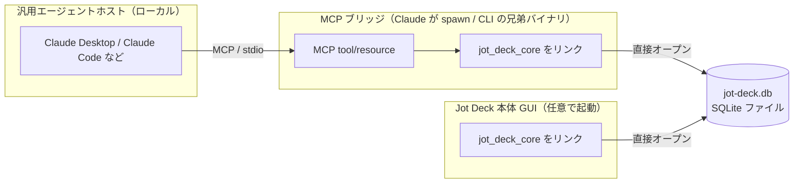

# Jot Deck MCP サーバ 設計書

## 概要

Jot Deck 本体は、自身の Deck に対する **書き込み・読み出し操作を MCP サーバとして公開**する。これにより Claude（Claude Desktop / Claude Code）をはじめとする汎用エージェントが、標準 MCP クライアントとして Deck に接続し、カードを書き込み・読み出しできる。

本書は「Jot Deck 本体を汎用エージェントに開く」外向きの関心事を、**単独で読めるように**扱う。本体が提供する共通基盤（ローカル書き込み口・Card Repository 等）は次節「前提」に要約するため、本書の理解に他ドキュメントを読む必要はない。同じ基盤を内向きに使う専用アダプタ「Reporter」は姉妹ドキュメント `007-reporter-protocol.md` で扱うが、両者は独立して読める。

> このドキュメントは構想段階の設計方針であり、実装済み仕様ではない。

---

## 前提: 本体の共通基盤（Reporter と共有）

本書が依拠する本体側の基盤を、単独で読めるようにここへ要約する。これらは Reporter（`007-reporter-protocol.md`）と本 MCP サーバが**共有する本体の資産**であり、どちらか一方に属するものではない。

| 基盤 | 役割 | 本書での使われ方 |
|:---|:---|:---|
| **共有 core ライブラリ（`jot_deck_core`）** | ULID / position の採番、INSERT、タグ抽出、論理削除を集約。SQLite ファイルへの唯一の書き込み経路 | ブリッジは CLI 同様これをリンクし DB ファイルを直接開く（§3） |
| **Card Repository** | 上記ライブラリ内の CRUD。書き込みの一元化 | エージェントの append/patch もここを通す（採番はエージェントに委ねない） |
| **外部変更観測** | 別プロセス起因のカード追加/更新を GUI が検知して差分描画 | エージェント起因の変更も同経路で反映（→ §7） |
| **認証スコープ** | 書き込み可能なカラム/デッキを絞る | エージェントのスコープ制限に流用（§5） |
| **カード長 backstop** | 1 カードの最大長 / 最大オープン時間の上限 | 暴走 append の抑止に流用（§5） |

> これらの詳細と設計根拠は `007-reporter-protocol.md` にもあるが、本書の理解には上表で足りる。

---

## 1. 方向性 ―― Deck を開く

MCP は「**サーバが tool/resource を公開し、ホスト（Claude 等）がそれを呼ぶ**」構造である。本設計では **Deck 側が write/read を MCP サーバとして公開し、エージェントがそのクライアントになる**。このときエージェントは「汎用 LLM で駆動される Reporter」として振る舞う。本設計の要諦は **「Deck を汎用エージェントに開く」** ことである。

---

## 2. 2 つのモード

### モード 1: エージェント = プロデューサ（Reporter の一般化）

専用バイナリ（文字起こし・監視）だった Reporter が、「**Deck の MCP tool を持った任意の LLM エージェント**」へ一般化される。

- 「この PDF を research カラムに要点カード化して」→ エージェントが `card.append` を呼ぶ。
- 自律エージェントが思考・行動・結果を Deck のカラムにリアルタイム記録（＝エージェントのタスクログ用途が、専用 Reporter を作らずゼロ実装で実現）。

### モード 2: エージェント = リーダ（KB としての Deck）

Deck が read/query を tool/resource として公開すれば、エージェントが蓄積カードを読んで「X について何を決めたか」に答えられる。**Deck が AI ナレッジベースになる**方向であり、書き込み（モード 1）と読み出し（モード 2）が MCP 上で対になって、Deck が**双方向のエージェント面**になる。

---

## 3. アーキテクチャ ―― CLI と同型の直接 DB アクセス

local-first を保ったまま、本体が既に持つ CLI と同じ方式で実現する。現行 CLI（`crates/core/bin/cli.rs`）は起動中の本体 GUI と通信せず、**SQLite ファイルを直接開いて `jot_deck_core` のリポジトリ関数を呼ぶ**。Tauri 本体（`packages/app/src-tauri`）も同じ DB ファイルを開く対等なクライアントである。MCP ブリッジもこの CLI の兄弟として実装する。

- **ブリッジは `mcpServers` で spawn される小さな MCP サーバ**で、CLI と同様に `jot_deck_core` をリンクして DB ファイルを直接開く。tool 呼び出しをリポジトリ関数へ写像するだけ。**ブリッジ↔本体 GUI の IPC は無く、GUI が起動していなくても動く。**
- **「Card Repository ＝書き込みの一元化点」はプロセスではなくライブラリ（`jot_deck_core`）**。採番・タグ抽出・論理削除がここに集約されているため、どのプロセス（GUI / CLI / ブリッジ）がリンクしても挙動は同一で、採番一元化（`007` §7）が保たれる。
- **local-first は保たれる**: ブリッジも本体もローカルの同一ファイルに書く。LLM 推論がリモートなのはエージェント側の事情であり、Deck の読み書きはローカルのまま。
- **隔離レベルのトレードオフ**: `007` の spawn モデル（子は DB に触れない）より隔離は弱く、ブリッジは DB を直接触れる。ただしエージェントが握るのは MCP tool だけ（生 SQL は握らない）で、scope / `private` フィルタはブリッジ実装が担保する。ブリッジが自製の信頼バイナリである限り成立する。
- この方式は 2 つの前提を要する:
    - **複数プロセスの DB 共有**: 現行 `create_file_db` は既定 rollback journal・busy_timeout 無しで、ブリッジと GUI が同一 `jot-deck.db` を同時に開くと `SQLITE_BUSY` が起きる。`create_file_db` を **WAL モード＋busy_timeout** 化し、GUI 側 `Mutex<Connection>` は書き込みトランザクションを長く握らない。
    - **GUI の外部変更観測**: 別プロセスの書き込みは GUI の `update_hook`（同一コネクションしか発火しない）を鳴らさないため、GUI は **`PRAGMA data_version` を約 1s 間隔でポーリング**（他コネクションの commit のみ値が変わる激安判定）し、変化時だけ `updated_at`/`deleted_at` 差分で可視カラムを再描画する。MCP 書き込みは ~1s 遅延で現実的なので file watch / notify は不要。

---

## 4. 公開する MCP サーフェス

本体の書き込み/読み出しメソッド（前提節の Card Repository）を MCP tool/resource として写像する。エージェントは確定チャネル（append/patch）だけを持ち、採番・タグ抽出・論理削除・変更通知はすべて本体側が担う（§4.4）。

一覧（詳細は §4.1–§4.3）：

| MCP 種別 | 名前 | 対応（本体メソッド） | 分類 | 説明 |
|:---|:---|:---|:---|:---|
| tool | `append_card` | `card.append` | 書き（モード1） | カラム末尾にカード作成、ULID を返す |
| tool | `patch_card` | `card.patch` | 書き（モード1） | 既存カードの本文を確定 edit |
| tool | `move_card` | `card.move` | 書き（モード1） | カードを別カラムへ移動 / 並べ替え（アンカー指定） |
| tool | `delete_card` | `card.delete` | 書き（モード1） | カードを論理削除（復元可能） |
| tool | `ensure_column` | `column.ensure` | 書き（モード1） | 名前キーで get-or-create（べき等）、ULID を返す |
| tool | `update_column` | `column.update` | 書き（モード1） | カラムの name / description / private を更新 |
| tool | `move_column` | `column.move` | 書き（モード1） | カラムの並べ替え（アンカー指定） |
| tool | `list_columns` | `deck.query` | 読み（モード2） | Deck のカラム構成を列挙 |
| tool | `read_card` | `card.read` | 読み（モード2） | カードを ID 取得 |
| tool | `search_cards` | `deck.query` | 読み（モード2） | FTS5 全文 + タグ/スコア/カラムで検索 |
| tool | `recent_cards` | `deck.query` | 読み（モード2） | カラムの直近カードを取得 |
| tool | `describe_deck` | ― | オンボーディング | 接続 Deck の実行時実体（カラム・実効範囲・制約値）を返す。→ §4.6 |
| resource | `deck://{deck_id}` | ― | 読み（モード2） | Deck/カラム/カードの読み取り面（KB 用途） |
| resource | `deck://schema` | ― | オンボーディング | `describe_deck` と同内容の読み取り面（自動ロード対応ホスト向けの補助）。→ §4.6 |

引数の `column_id` / `card_id` はいずれも本体が採番した **ULID**。エージェントはまず `list_columns` / `search_cards` で ID を発見してから書き込む（ID をエージェントに推測・生成させない）。

### 4.1 書き込み tool（モード1）

#### `append_card`
- **引数**: `column_id`（string, ULID, 必須）, `content`（string, 必須）, `idempotency_key`（string, 任意）
- **返り値**: `{ card_id, column_id, position, created_at }`
- **べき等性**: `idempotency_key` を添えると、同一キーの再送は新規作成せず既存カードの id を返す（ホスト再送での重複防止 → §5）。
- **意味**: 指定カラムの末尾に新規カードを作成。**position の採番と ULID 発番は本体 Repository が行う**（§4.4）。`content` 中の `#tag` は本体が自動抽出する（`002-data-structure.md` §2）。エージェントに複数枚を作らせたい入力は、Reporter 同様「短いカードの連なり」として複数回 `append_card` を呼ばせる（1 枚を成長させない）。

#### `patch_card`
- **引数**: `card_id`（string, ULID, 必須）, `content`（string, 必須）, `expected_updated_at`（string, 必須 ―― 直前に読んだ `updated_at`）
- **返り値**: `{ card_id, updated_at }`
- **意味**: 既存カードの本文を確定置換。永続化し同期に乗る。タグは再抽出される。ストリーミングの途中表示ではなく**確定 edit のみ**（`card.stream.*` は非公開）。`expected_updated_at` は**必須**で、ユーザ手編集との lost update を楽観ロックで防ぐ（`002-data-structure.md` §5.3 の compare-and-swap。現在値と不一致なら拒否 → `read_card` で再読込して再試行）。無条件上書きは公開せず、更新は常に CAS で守られる。

#### `move_card`
- **引数**: `card_id`（string, ULID, 必須）, `to_column_id`（string, ULID, 任意 ―― 省略時は同カラム内で並べ替え）, `before_card_id` / `after_card_id`（string, ULID, どちらか任意 ―― 省略時は移動先カラムの末尾）
- **返り値**: `{ card_id, column_id, position }`
- **意味**: カードのカラム間移動と並べ替えを 1 メソッドで扱う。**エージェントは「どのカードの前/後ろ」というアンカーで意図を表明し、実際の position 値は本体が採番/再配分する**（生の position 整数を渡させない）。アンカー指定は index 指定より並行編集に強い。同じ位置への move は no-op（再送に安全）。移動先は**接続 Deck 内のカラムに限る**（Deck 越えは不可 → §4.4）。移動先が write スコープ外なら authorization error。

#### `delete_card`
- **引数**: `card_id`（string, ULID, 必須）
- **返り値**: `{ card_id, deleted_at }`
- **意味**: カードを**論理削除**（`deleted_at` を打つ）。物理削除・カラム連動削除・復元はエージェントに公開しない ―― 30 日後の物理削除は本体の cleanup が担い、復元はユーザの削除スタック（`u` / ゴミ箱）に委ねる。誤削除しても失われないことを安全域（§5）の前提にする。この tool は書き込みスコープに `delete` 権限が含まれる場合のみ有効（§5）。

#### `ensure_column`
- **引数**: `name`（string, 必須）, `description`（string, 必須 ―― 分類軸の 1 行説明。`002-data-structure.md` の Column `description`）, `private`（bool, 任意, 既定 `false`）。作成先は**接続 Deck 固定**（`deck_id` は取らない ―― Deck 越え・Deck 作成は不可 → §4.4）。
- **返り値**: `{ column_id, name, position, created }`（`created` は新規作成なら true / 既存ヒットなら false）
- **意味**: **名前キーで get-or-create するべき等な作成**。同名カラムが**接続の可視範囲に**あればその ULID を返し（get）、無ければ末尾に作成する（create）。自由な `create` を避けることで、再送での重複列と、既存列を見落としたニアデュープ（`ToDo`/`Tasks` 乱立）を同時に抑える。
- **作成の可否**: create は、接続が **structure capability を持ち（既定 ON、opt-out で無効化可 → §5）** かつ **write allowlist が明示されていない**ときだけ成功する。structure を deny した接続、または allowlist を明示した接続では **create はエラー**で失敗する（allowlist は固定集合の意図なので新規作成と排他）。ただし可視範囲の同名カラムがあれば get として id を返す ―― **既存カラムの読み取りは妨げない**。名前 lookup は可視範囲のみを探索し、private / スコープ外の同名はヒットさせず（漏洩防止）、列は ULID キーなので見かけ上の重複名は許容する。

#### `update_column`
- **引数**: `column_id`（string, ULID, 必須）, `name` / `description` / `private`（いずれも任意, 指定分のみ更新）
- **返り値**: `{ column_id, name, description, private }`
- **意味**: カラムの改名・分類軸の書き換え・公開/非公開の切り替え。大規模再編で「このカラムの意味を変える」操作を担う。write スコープ外カラムは authorization error。

#### `move_column`
- **引数**: `column_id`（string, ULID, 必須）, `before_column_id` / `after_column_id`（string, ULID, どちらか任意 ―― 省略時は末尾）
- **返り値**: `{ column_id, position }`
- **意味**: カラムの並べ替え。`move_card` と同じくアンカーで意図を表明し、position 値は本体が採番/再配分する。ユーザのカラム順（`002-data-structure.md` §4 のフォーカス位置）を動かすため、大規模再編の主対象であると同時に暴走時の影響も大きい（§5）。

### 4.2 読み出し tool（モード2）

#### `list_columns`
- **引数**: なし（対象は接続 Deck 固定）
- **返り値**: `[{ column_id, name, description, position, card_count }]`（position 昇順、削除済み・非公開カラムを除く）
- **意味**: 書き込み/検索対象のカラム ID をエージェントが発見するための入口。read 可視性制御（§5）で除外されたカラムは返さない。

#### `read_card`
- **引数**: `card_id`（string, ULID, 必須）
- **返り値**: `{ card_id, column_id, content, score, tags, position, created_at, updated_at }`
- **意味**: 文脈把握・patch 対象の特定に使う単体取得。

#### `search_cards`
- **引数**: `query`（string, 任意, FTS5 全文検索）, `column_id`（string, 任意, 絞り込み）, `tags`（string[], 任意, AND）, `min_score`（number, 任意）, `limit`（number, 任意, 既定 20 / 上限あり）
- **返り値**: `[{ card_id, column_id, content, score, tags, created_at }]`（関連度 or スコア降順）
- **意味**: モード2（KB としての Deck）の中核。FTS5・タグ・スコア・カラム所属という第一級のインデックスをそのまま tool 面に出す。非公開カラムのカードは結果から除外。

#### `recent_cards`
- **引数**: `column_id`（string, 任意）, `limit`（number, 任意, 既定 20 / 上限あり）
- **返り値**: `search_cards` と同形（`created_at` 降順）
- **意味**: 「直近何が起きたか」をクエリ無しで引く軽量パス。エージェント・タスクログ用途（追記の直後に自分の書いた末尾を読み返す）で使う。

### 4.3 resource

- **`deck://{deck_id}`**: Deck / カラム / カード階層の読み取り面。KB 用途で MCP クライアントが列挙・購読する。tool の read 系と同じ可視性制御（§5）を通し、非公開カラムを含めない。

### 4.4 本体に委ねる責務（tool に出さないこと）

**大規模な構造変更・カード再編こそエージェントに委譲したい関心事**であり、カラムの作成/改名/並べ替え・カードの移動はすべて書き込み面に出す（§4.1）。その上で、次の 3 点は引き続き**意図的に tool 面へ出さない**：

- **ID / position 値の採番**: ULID 発番と position 値の割り当て/再配分は本体 Repository が一元化する（`007` §7）。エージェントは ID を握り、順序は「どのカード/カラムの前後」という**アンカーで意図だけ表明**する（`move_card` / `move_column`）。生の position 整数は渡させない。
- **ストリーミング**: `card.stream.*`。途中経過表示は一次 Reporter 固有の関心事で、エージェントは確定チャネル（append/patch/move）で足りる。
- **物理削除・復元**: cleanup とユーザの削除スタックが担う（§4.1 `delete_card`）。構造ミスもカラム/カードの論理削除＋アンドゥ（`002-data-structure.md` §3）で復元可能であることが、構造変更をエージェントに開く前提になる。

### 4.5 可視性スコープ（read / write の絞り込み）

**接続の単位は Deck**。ブリッジを 1 つの Deck につなぐ＝その Deck が**設定ゼロで読み書き可能な KB** になる。これを最優先の既定とし、絞り込みは後付けのオプションに徹する。

- **Deck が既定スコープであり、blast radius の壁**。接続は 1 Deck を指し、越境しない（Deck の作成・Deck 間のカード/カラム移動は不可 → §4.1 / §4.4）。複数 Deck を扱いたければ Deck ごとに別ブリッジをつなぐ。
- **`private` が唯一の hard 除外**。ユーザが本体 UI で `private` を立てたカラムだけが、全接続から読めず・書けなくなる。read allowlist を手で書かせない ―― これが「ゼロ実装 KB」（§6）の約束。
- **カラム単位 allowlist は任意の絞り込み**。既定は Deck 全体が可視・可書。`mcpServers` 設定で read/write allowlist を書いた接続だけ、そこへさらに絞る（write は read より狭くてよい）。設定しなければ「private を除く Deck 全体」が実効範囲。
- **構造変更は既定 ON・opt-out**。既定接続は Deck 内をフル再編できる（§4.4）。structure capability を deny すれば構造変更（`ensure_column` / `update_column` / `move_column`）を封じられる。さらに **write allowlist を明示した接続では `ensure_column` の新規作成が無効**（固定集合の意図と排他。既存カラムの取得は可）＝ allowlist と新規作成は両立しない。

実効範囲 = `接続 Deck 内の private でないカラム` ∩ `allowlist（指定があれば。無指定なら全部）`。安全は必須設定ではなく **`private` ＋ カード長 backstop ＋ 論理削除アンドゥ（§5）＋ 監査**で担保する。

**設定（`mcpServers`）**: 対象 Deck は、ブリッジを spawn する `mcpServers` エントリの**環境変数 `JOT_DECK_DECK_ID`（ULID）で渡す**（任意の allowlist も同様に env で）。**DB パスは本体と同じ固定の app data dir（identifier `com.jot-deck.app`）をブリッジが自力で導出する**ため env には出さない（`JOT_DECK_DB_PATH` は dev / 非標準インストール向けの任意オーバーライドに留める）。ブリッジ本体は本番では Tauri サイドカー（`externalBin`）として同梱し、パスを本体だけが知る。deck id はユーザが直接目にしない ULID なので、**本体 GUI が deck id の表示/コピーに加え、貼り付け可能な設定スニペット（ブリッジの絶対パス＋deck id を埋めた `mcpServers` エントリ）を生成する**（Deck 管理 UI の「Copy MCP server config」/「MCP id」）。バイナリパスも DB パスも本体だけが正確に知るため、ユーザに OS 別パスを推測させない。

**フィルタは必ず本体（Card Repository のクエリ）側で行う。** ブリッジは spawn される補助プロセスで、その先のエージェントはプロンプトインジェクションで操作され得る。信頼境界は本体であり、ブリッジに絞り込みを委ねない。

除外カラムに対する各 tool の挙動（存在を漏らさない）：

| tool | 除外カラムでの挙動 |
|:---|:---|
| `list_columns` / `deck://` | 列挙に出さない（ID すら発見させない） |
| `search_cards` / `recent_cards` | 該当行をフィルタ。除外カラムを `column_id` 明示指定した場合は空ではなく authorization error |
| `read_card` | not found 相当（存在を漏らさない） |
| `append_card` / `patch_card` / `delete_card` | write allowlist 外は authorization error |

> カード単位・`#secret` タグ単位の除外はより細かいが、FTS クエリを複雑化するため当面はカラム単位に留める（将来拡張）。

### 4.6 クライアント・オンボーディング面（自己記述）

接続したエージェントが Jot Deck のデータモデルと制約を即座に掴み、正しくカラム/カード運用できるようにする。方針は「静的ドキュメントを読ませる」ではなく **接続時にプロトコルで自己記述させる**。4 層で与える。

**1. MCP `instructions`（initialize 応答）＝メンタルモデルの一枚**
ホストの system context に載る短い primer。製品の世界観を外させない：

- 階層は Deck > Column > Card。カードは **tweet サイズの原子単位**。
- **長い入力は 1 枚を成長させず、短いカードの連なりとして `append_card` を複数回**呼ぶ（最重要）。
- `#tag` は本文に書けば本体が自動抽出。position / ID は本体が採番するので**推測・生成しない**。
- カラム作成は `structure` capability が有効で write allowlist 未指定の接続に限り `ensure_column` で行える（allowlist を明示した接続では新規作成は無効。→ §4.5）。削除は論理削除で復元可能。

**2. `describe_deck`（bootstrap tool）＝この接続の実行時実体と制約**
静的仕様ではなく**接続時点の実体**を 1 回で返す：

- 可視カラム一覧（下記 purpose 付き）。
- **この接続の実効範囲**（読める / 書けるカラム、接続 Deck）。既定は Deck 全体（§4.5）だが、絞り込み接続や `private` の除外結果をエージェントが自分で把握でき、ユーザが口頭で説明する必要がなくなる。
- 制約値：カード最大長、`search_cards` / `recent_cards` の `limit` 上限、append レート上限、タグ記法。

**tool を主とする**理由：これはモデル起点で・冪等で・全 MCP ホストで均一に動き、かつ **move / ensure で構造を変えた後にエージェントが最新実体を取り直せる**（resource は再取得がモデル駆動でない）。常時プライマは 1 の `instructions` が賄うので、`describe_deck` の価値は「変化する実体の再取得」にある。補助として、セッション開始時に自動ロードできるホスト向けに resource `deck://schema` を併設してよい（同じ内容の読み取り面）。

**3. カラムの purpose メタ（分類軸の説明）**
`list_columns` / `describe_deck` は名前だけでなく **「ここに何を入れるか」の 1 行説明**を返す。`決定事項` `ToDo` `論点` のような名前だけでは振り分けが当てずっぽうになる。これは Reporter のカラムテンプレート（`007` §9）を tool 面へ出したもので、分類精度に最も効く。

**4. tool description と error をティーチング面に使う**
- 各 tool の description に制約と最小の呼び出し例（「まず `list_columns` で ID を得てから書く」）。
- **error を誘導に使う**：長さ超過は「最大 N 文字、複数カードに分割せよ」、不正 `column_id` は有効な ID 候補を返す。エージェントは error で正しい振る舞いに収束する。

---

## 5. 安全域（開くことの代償）

汎用エージェントにローカル KB への書き込みを許すと、プロンプトインジェクションと無制限書き込みが現実の脅威になる。MVP は下表の防具でラインを引く（sanitization・破壊操作の host 確認・完全監査ログといった重い対策は、サードパーティ開放時に引き上げる将来課題 → §7）。

| 防具 | 内容 |
|:---|:---|
| **Deck 境界** | 接続は 1 Deck に固定され、越境しない（Deck 作成・Deck 間移動は不可）。Deck がユーザの最上位の整理意図であり、blast radius の壁。→ §4.4 / §4.5 |
| **`private` 除外** | ユーザが立てた `private` カラムは全接続から読めず・書けない。既定 KB（設定ゼロで Deck 全体可視・可書）の唯一の hard な穴。フィルタは本体側。→ §4.5 |
| **capability（opt-out）** | 接続の権限 read / append / edit / delete / structure は**既定すべて有効**（設定ゼロで Deck 全体を読み書き・再編＝§4.5 と一致）。機微な用途では個別に **deny して絞る**（例: KB 読取専用なら append 以降を deny、re-org させたくない接続は structure を deny）。allowlist を明示した接続では `ensure_column` の新規作成が無効（§4.5）。 |
| **injection の代償と回復性** | 既定接続は追記に加え編集・削除・再編もできるため、`search_cards` で読んだ悪意コンテンツが誘発しうる操作は広い。この代償を **①削除・カスケード削除は論理削除＋アンドゥで復元でき、上書き・改名・移動は誤操作の拡散を境界（Deck）とレート制限で抑える** と **②機微な接続は capability を deny して封じられる** ことで受ける。外部由来カードには provenance ラベルを付す。 |
| **構造の復元性** | カラム/カードの削除ミスは論理削除＋アンドゥ（`002` §3）で戻せる。ただし `patch_card` の内容上書き・`update_column` の改名・`move_card` / `move_column` の位置変更は論理削除の対象外で、以前の状態を自動復元する保証はない（before/after を持つ耐久リビジョン履歴は将来課題 → §7）。これらは境界・CAS・レート制限で暴走の代償を抑える。 |
| **カード長 backstop** | 1 カードの最大長（本体のカード長 backstop）。 |
| **レート制限** | 接続ごとの writes/分 上限。カード長 backstop が縛れない「小カード大量投入」の暴走を抑える。 |
| **べき等性** | `append_card` は idempotency key を受け、同一キーの再送は新規作成せず既存 id を返す。ホスト再送での重複カードを防ぐ。 |
| **帰属** | 各書き込みに接続 id を記録し、どの接続（ブリッジ）起因かを辿れる。`source=agent` フラグの上位互換。 |

---

## 6. full MCP 準拠との関係

MCP 準拠レベルは、内向き（専用 Reporter）と外向き（本書＝エージェント境界）で分けると整理できる。

- **一次 Reporter（文字起こし・監視、内製）**: 独自 JSON-RPC（「MCP にならう」）のままでよい。速さ・単純さ優先、外部再利用なし。
- **エージェント境界（本書）**: **ここでフル MCP 準拠が効く**。標準 MCP ホストがゼロ実装で接続でき、①エージェント・タスクログ Reporter がタダで実現、②Deck が Claude から読める KB になる、③サードパーティが既存 MCP エコシステム経由で Deck に繋がり、事業上の堀（レシピ/エコシステム）を MCP に相乗りできる。

すなわち **full MCP 準拠のコストはエージェント境界に限定して払う**。内部 Reporter は独自プロトコルで回る。

---

## 7. 未決事項

| 項目 | 内容 |
|:---|:---|
| **将来のハードニング（サードパーティ開放時）** | MVP は §5 の防具でラインを引く（capability opt-out・レート制限・idempotency・接続 id 帰属）。外部に Reporter/レシピを作らせる段階では、content sanitization・破壊操作の host 確認/dry-run・完全監査ログ（before/after）へ引き上げる。→ §5 |

---

## 8. 関連ドキュメント

- `007-reporter-protocol.md` - 同じ本体基盤を内向きに使う専用 Reporter プロトコル（姉妹設計。本書とは独立に読める）
- `002-data-structure.md` - データモデル（公開対象のカード/カラム/Deck。`private` 属性の追加先）
